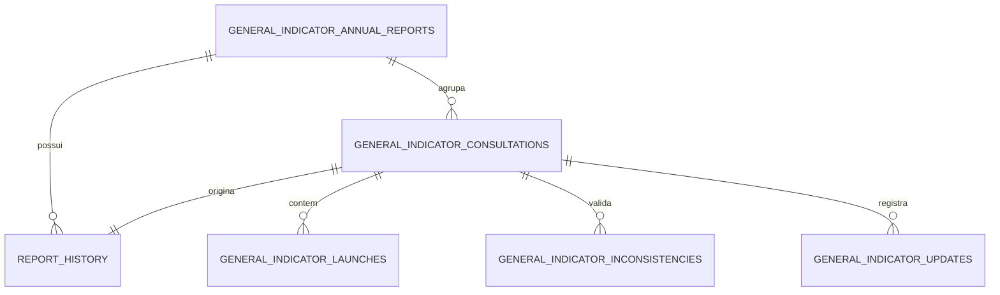

# Modelo de dados

Versão documental: **28/07/2026**.

## Bancos

| Banco | Uso |
| --- | --- |
| PostgreSQL | Estado da aplicação, configurações, importações, consultas, snapshots e histórico |
| SQL Server/TFS | Fonte somente leitura de lançamentos, work items, hierarquia e TAGs |

O PostgreSQL é a fonte de verdade dos relatórios salvos. O SQL Server não é consultado ao abrir um relatório.

## Bootstrap e versionamento

- `database/init.sql`: domínio original de Projetos e dados iniciais.
- `backend/migrations/*.sql`: evolução versionada, principalmente Indicadores Gerais.
- `schema_migrations`: versão, checksum e data de aplicação.
- `backend/app/services/schema_service.py`: compatibilidade idempotente do domínio legado.

Migrations são aplicadas em ordem lexical sob lock transacional e não podem ser editadas depois de aplicadas.

## Domínio Projetos

### Configuração

| Tabela | Finalidade |
| --- | --- |
| `categorias` | Categorias de classificação de projetos |
| `subcategorias` | Cargos/subcategorias |
| `palavras_chave_categoria` | Termos vinculados às categorias |
| `classification_rules` | Regras, prioridade e versão |
| `perfis_colaborador` | Perfil e participação nos Indicadores Gerais |
| `colaboradores_ignorados` | Logins explicitamente ignorados |

### Importação e staging

| Tabela | Finalidade |
| --- | --- |
| `import_sessions` | Sessão temporária e conteúdo do arquivo |
| `staging_rows` | Linhas normalizadas antes da confirmação |
| `import_logs` | Eventos e métricas do pipeline |
| `importacoes` | Cabeçalho confirmado |
| `lancamentos_horas` | Lançamentos finais |
| `erros_importacao` | Erros/alertas |
| `duplicidades_importacao` | Grupos e resolução de duplicidade |
| `classificacoes_task` | Classificação sugerida/final |
| `pending_reviews` | Pendências operacionais |
| `classification_reprocess_history` | Antes/depois do reprocessamento |

### Relatórios e auditoria

| Tabela | Finalidade |
| --- | --- |
| `comparativos_projetos` | Comparativo salvo |
| `comparativos_projetos_importacoes` | Importações do comparativo |
| `analytics_insights` | Insights operacionais |
| `audit_log` | Auditoria genérica |
| `auditoria_acoes` | Auditoria legada por importação |

## Domínio Indicadores Gerais

### `general_indicator_consultations`

Uma execução de consulta/validação.

Campos relevantes:

- período e status;
- `resumo` de progresso/validação;
- `resultado` JSONB do snapshot oficial;
- erro e timestamps;
- versões de contrato, hierarquia, cálculo, classificação, distribuição e metas;
- responsáveis;
- `snapshot_hash` e `resultado_hash`;
- vínculo opcional com o contêiner de relatório salvo.

### `general_indicator_launches`

Snapshot técnico por lançamento:

- `consulta_id`;
- `id_lancamento`, Task, pai e Feature;
- tipo real do pai;
- categoria validada;
- estado de validação;
- duração;
- `dados_tecnicos` JSONB com hierarquia, TAGs, origem e participação.

Restrição única parcial:

```text
(consulta_id, id_lancamento), quando id_lancamento não é nulo
```

### `general_indicator_inconsistencies`

Pendências e tratamentos:

- escopo Feature ou lançamento;
- tipo, severidade, status e indicador de bloqueio;
- IDs relacionados;
- descrição, texto original e tratamento;
- histórico ativo/inativo;
- detalhes JSONB com causa raiz, impacto, hierarquia e evidências.

### `general_indicator_updates`

Histórico de atualização seletiva ou completa:

- estado anterior/resultante;
- pendências antes/resolvidas/abertas;
- novas inconsistências;
- Features reconsultadas;
- lançamentos revalidados;
- timestamps e erro.

### `general_indicator_distribution_weights`

Configuração global:

- `category_name`;
- `distribution_weight` inteiro entre 1 e 5;
- `default_weight`;
- `active`;
- usuário e timestamps.

As alterações são registradas em `audit_log`.

## Relatórios salvos e snapshots

### `general_indicator_annual_reports`

Nome histórico mantido por compatibilidade. Desde a migration `0011`, cada linha representa um **relatório independente**, não necessariamente anual.

Campos:

- tipo e nome;
- ano auxiliar;
- revisão atual;
- consulta ativa;
- período atual;
- criação/atualização e responsáveis.

Não existe mais unicidade por ano.

### `report_history`

Revisões/snapshots vinculados ao relatório:

- consulta fonte;
- período;
- nome;
- número de revisão;
- estado legado `CURRENT`, `SUPERSEDED` ou `ARCHIVED`;
- vínculos entre revisões;
- datas e responsáveis;
- totais e KPIs indexados para listagem;
- versão do contrato e hash;
- vínculo com `general_indicator_annual_reports`.

O snapshot funcional completo fica em `general_indicator_consultations.resultado`. `report_history` fornece identidade, revisão, filtros e resumo rápido.

### `annual_report_migration_issues`

Registra incompatibilidades preservadas durante a migração do modelo histórico anual. Não recalcula snapshots antigos.

## Cascatas e imutabilidade



- exclusão do relatório é transacional e remove revisões/consultas dependentes;
- uma consulta finalizada não pode ter lançamentos regravados;
- leitura de relatório usa o JSONB persistido;
- hashes detectam alteração do conteúdo;
- números históricos de revisão não são renumerados.

## Migrations de Indicadores Gerais

| Versão | Conteúdo |
| --- | --- |
| `0001` | consultas, lançamentos, inconsistências e atualizações |
| `0002` | índices de desempenho |
| `0003` | participação de colaboradores |
| `0004` | versão do contrato de hierarquia |
| `0005` | snapshot oficial, versões e hashes |
| `0006` | histórico de relatórios |
| `0007` | responsável pelo arquivamento |
| `0008` | agrupamento/revisões e migração de históricos |
| `0009` | pesos de distribuição |
| `0010` | gestão, defaults, faixa 1–5 e auditoria |
| `0011` | relatórios independentes, sem unicidade anual |

## Índices principais

- lançamentos por consulta, ordem e `IdLancamento`;
- inconsistências ativas por consulta;
- consultas em processamento;
- histórico por relatório/revisão e período;
- listagem de relatórios por atualização;
- pesos ativos;
- importações por hash/nome;
- lançamentos de projeto por importação, usuário, data e categoria.

## Fonte SQL consolidada

Consulte [10-estrutura-banco.sql](10-estrutura-banco.sql). O arquivo referencia os scripts canônicos em vez de duplicar seu conteúdo.
