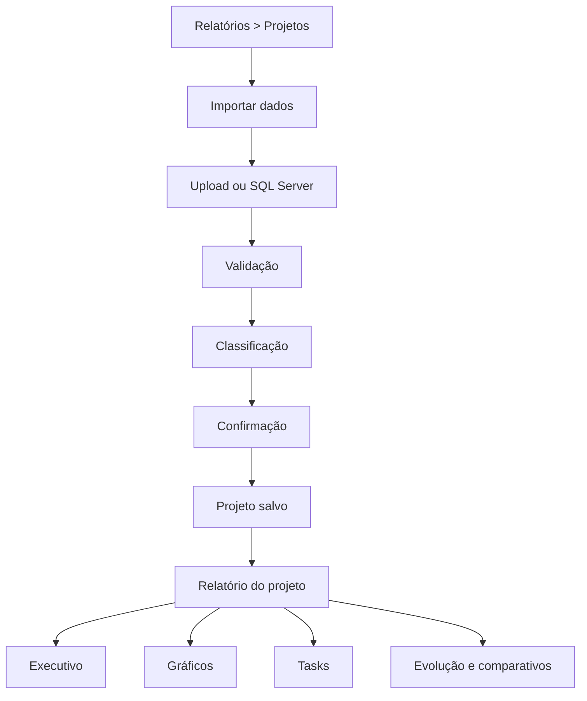
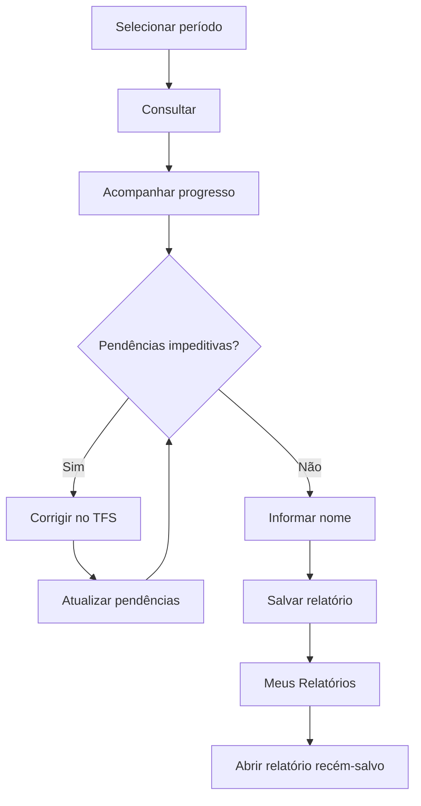
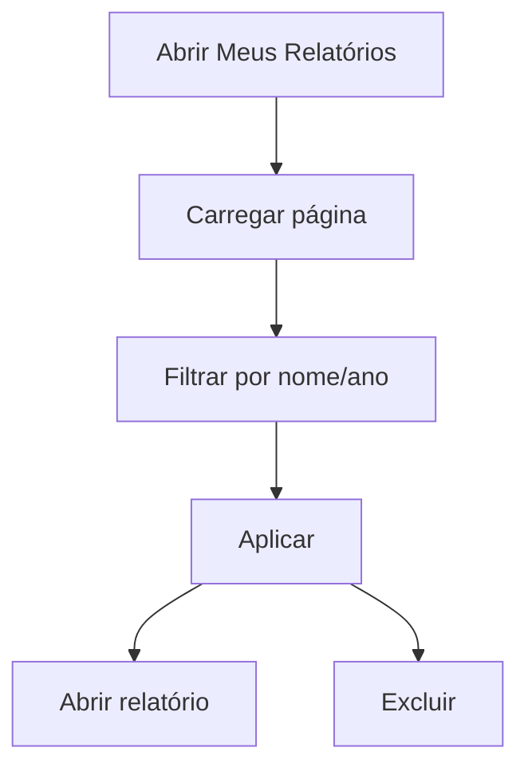

# Fluxo de telas

Versão documental: **28/07/2026**.

## Navegação lateral

```text
Relatórios
├── Projetos
├── Indicadores Gerais
└── Meus Relatórios

Configurações
├── Configurações gerais
├── Distribuição das categorias
└── Módulos
```

- apenas um grupo fica expandido;
- a rota atual reabre automaticamente seu grupo;
- o grupo pai não recebe o mesmo destaque do item ativo;
- estado é preservado localmente quando aplicável.

## Projetos



### Estados

- vazio;
- enviando/processando;
- bloqueios;
- alertas;
- revisão de duplicidade;
- colaboradores sem perfil;
- pronto para confirmar;
- confirmação em andamento;
- sucesso/abertura do relatório;
- erro recuperável.

## Indicadores Gerais



### Consulta

- filtros em linha: ano, data inicial, data final e botão;
- atalhos apenas preenchem;
- durante processamento, botão é bloqueado e mostra carregamento;
- progresso indica etapa, percentual e mensagem;
- a consulta só ocorre após clique.

### Validação

Com pendências:

- resumo de impacto;
- inconsistências agrupadas por causa;
- Task, PBI/Bug, Feature esperada, tipo encontrado, lançamentos e horas afetadas;
- instrução de correção;
- ação principal **Atualizar pendências**.

Sem pendências:

- título **Validação concluída**;
- resumo de lançamentos e horas;
- campo de nome;
- botão **Salvar relatório**.

Não há dashboard final nessa tela.

## Meus Relatórios

### Listagem



Comportamentos:

- atualização manual no topo;
- alerta de sucesso fecha em 4 segundos e mantém fechamento manual;
- erro permanece visível;
- paginação aparece apenas quando o total ultrapassa o tamanho da página;
- estado vazio distingue “nenhum relatório” de “nenhum resultado para filtros”.

### Relatório salvo

```text
← Nome do relatório

Visão Geral | Análises
```

**Visão Geral**:

- resumo;
- KPIs;
- evolução;
- gráficos de categoria/composição;
- composição das horas;
- distribuição de Atualização do sistema;
- comparativo trimestral quando aplicável.

Auditoria de lançamentos permanece persistida, mas não é exibida como bloco principal.

**Análises**:

- seletor interno compacto com **Por período** e **Comparação**;
- período oficial disponível;
- data inicial/final limitadas ao snapshot;
- atalhos Período completo, Primeiro mês e Último mês;
- botões Analisar e Limpar;
- quatro KPIs, composição e evolução do recorte;
- granularidade diária até 31 dias e mensal acima de 31 dias;
- estados inicial, carregando, resultado, vazio e erro.

## Configurações gerais

Áreas funcionais:

- categorias;
- subcategorias;
- palavras-chave;
- regras;
- colaboradores;
- participação nos Indicadores Gerais.

O bootstrap agrega leituras para reduzir carregamento inicial.

## Distribuição das categorias

- tabela com categoria, participação na distribuição e peso;
- salvar;
- restaurar distribuição proporcional padrão, com peso 1;
- explicação e exemplo simples da distribuição mensal;
- pesos entre 2 e 5 aumentam a prioridade da categoria;
- alterações afetam somente novas consultas e não modificam snapshots finalizados.

## Metas dos indicadores

- lista períodos de vigência;
- cria, edita e exclui metas;
- valida datas, percentuais e sobreposição;
- mantém 2025 e 2026 como configurações iniciais;
- novas consultas exigem vigência única cobrindo todo o período;
- alterações afetam somente novas consultas e não modificam snapshots finalizados.

## Módulos

- cards de total, ativos e inativos;
- busca e filtro por status;
- tabela com TAG completa, status e última atualização;
- confirmação antes de ativar ou inativar;
- `Atualizar módulos` consulta o TFS e inclui somente novas TAGs `1-`;
- módulos inativos continuam visíveis e seus lançamentos permanecem auditáveis.

## Responsividade

- filtros e ações quebram para múltiplas linhas;
- gráficos passam para uma coluna;
- botões principais ocupam 100% apenas quando necessário no mobile;
- menus e controles preservam navegação por teclado e atributos ARIA.

## Telas preservadas fora da navegação

- Dashboard;
- Histórico;
- Auditoria;
- Inteligência Operacional.

Essas páginas não devem ser removidas sem auditoria, mas também não devem ser tratadas como rotas ativas do menu atual.
