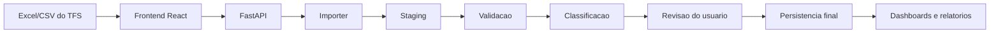

# Arquitetura Tecnica

## Objetivo

Organizar o MVP como um sistema interno, local e evolutivo para analise operacional de horas apontadas no TFS 2015.

O desenho atual evita reescrita ampla e separa responsabilidades em camadas pequenas, testaveis e compativeis com o fluxo de importacao ja existente.

## Stack

```text
Frontend: React + TypeScript + Vite
Backend: Python + FastAPI
Banco: PostgreSQL
Processamento: pandas + openpyxl
Ambiente: Docker Compose
```

## Visao Geral



## Fluxo De Importacao

```text
Upload
-> processamento temporario
-> validacao
-> revisao
-> classificacao
-> confirmacao do usuario
-> persistencia final
```

O arquivo importado primeiro cria uma sessao temporaria em `import_sessions` e linhas cruas em `staging_rows`. A persistencia final so acontece depois da confirmacao do usuario.

## Backend

### Rotas

```text
backend/app/api/routes/imports.py    Importacao, staging e conclusao
backend/app/api/routes/dashboard.py  Indicadores e linha do tempo
backend/app/api/routes/reports.py    Relatorios agregados
backend/app/api/routes/exports.py    Exportacoes CSV
backend/app/api/routes/settings.py   Configuracoes de classificacao
backend/app/api/routes/analytics.py  Insights operacionais preservados no backend
backend/app/api/routes/audit.py      Auditoria tecnica preservada no backend
```

### Services

```text
classification_service.py
```

Responsavel por capturar a categoria no primeiro colchete do titulo da Task, aplicar perfil operacional do colaborador como subcategoria analitica e sinalizar registros fora do padrao para revisao.

```text
validation_service.py
```

Responsavel por colunas obrigatorias, campos vazios, duracao, data, duplicidades e alertas operacionais.

```text
import_record_builder.py
```

Responsavel por montar os registros finais que serao persistidos em `lancamentos_horas`.

```text
staging_row_builder.py
```

Responsavel por montar as linhas temporarias para `staging_rows`, preservando dados crus e classificacao inicial.

```text
import_persistence_service.py
```

Responsavel por gravar importacao final, issues, lancamentos, classificacoes e resolucoes de duplicidade.

```text
import_service.py
```

Responsavel por orquestrar validacao da planilha e montagem dos registros finais via builders.

```text
import_pipeline.py
```

Responsavel pelo ciclo de staging: criar sessao, reprocessar, cancelar e concluir importacao.

```text
schema_service.py
```

Responsavel por garantir ajustes incrementais no schema durante a subida do backend.

### Repositories

```text
import_repository.py
staging_repository.py
```

Concentram o acesso direto ao PostgreSQL. As regras ficam nos services.

## Frontend

### Estrutura

```text
frontend/src/components
frontend/src/components/settings
frontend/src/components/validation
frontend/src/hooks
frontend/src/pages
frontend/src/services
frontend/src/types
frontend/src/utils
```

### Telas

```text
Dashboard
Importacao
Validacao
Relatorios
Configuracoes
```

Historico, Auditoria e Inteligencia Operacional existem no codigo/backend, mas estao ocultos na navegacao principal neste momento.

O `App.tsx` atua como composicao principal. Sidebar, filtros, timeline, validacao, relatorios e configuracoes foram separados em componentes menores.

O frontend usa lazy loading para carregar telas sob demanda e reduzir o bundle inicial.

## Banco De Dados

Tabelas principais:

```text
import_sessions
staging_rows
import_logs
importacoes
lancamentos_horas
erros_importacao
duplicidades_importacao
classificacoes_task
categorias
subcategorias
palavras_chave_categoria
perfis_colaborador
colaboradores_ignorados
classification_rules
pending_reviews
comparativos_projetos
comparativos_projetos_importacoes
audit_log
auditoria_acoes
classification_reprocess_history
analytics_insights
```

Observacao: `analytics_insights`, `audit_log` e tabelas de historico permanecem no banco mesmo com suas telas ocultas, pois preservam compatibilidade de API, trilha tecnica e evolucoes futuras.

## Regras Preservadas

- Nao assumir regra trabalhista.
- Nao calcular jornada esperada.
- Nao analisar banco de horas ou hora extra como regra formal.
- Usar `IdLancamento` como unica chave de duplicidade.
- Bloquear conclusao com duplicidade sem resolucao.
- Permitir que o usuario escolha qual linha duplicada manter.
- Manter classificacao por `IdTask` como fluxo de revisao agrupada.
- Salvar classificacao final escolhida pelo usuario.
- Manter dados em staging antes da persistencia final.

## Testes

Os testes ficam em:

```text
backend/tests
```

Rodar pelo container:

```powershell
docker compose run --rm -T -v "C:\Projetos\analise-horas-tfs\backend\tests:/app/tests" backend python -m unittest discover -s tests
```

Coberturas atuais:

```text
classification_service
validation_service
import_record_builder
staging_row_builder
import_persistence_service
import_service
import_pipeline
```

## Proximas Evolucoes Tecnicas

- Criar script unico de validacao local.
- Adicionar testes de API com FastAPI TestClient.
- Padronizar logs de suporte em tela.
- Criar tela detalhada de logs da importacao.
- Adicionar migrations formais quando o sistema sair do MVP local.
- Avaliar IA apenas para insights e analises complexas, sem enviar dados externos por padrao.
