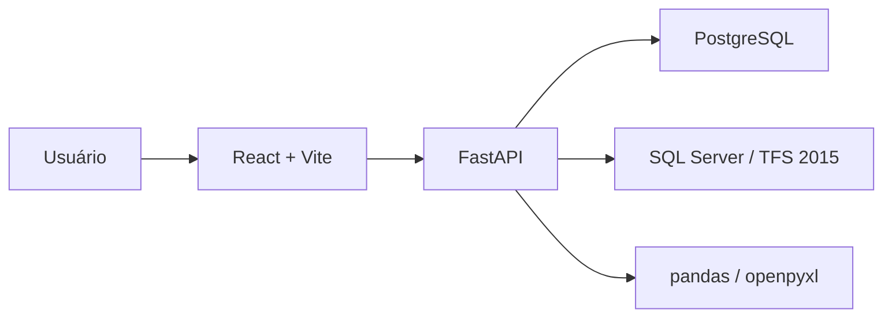
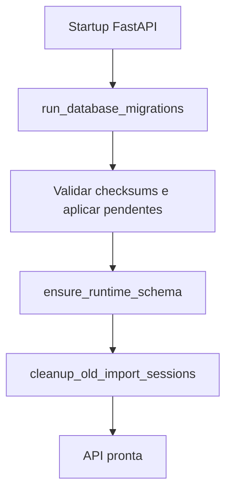
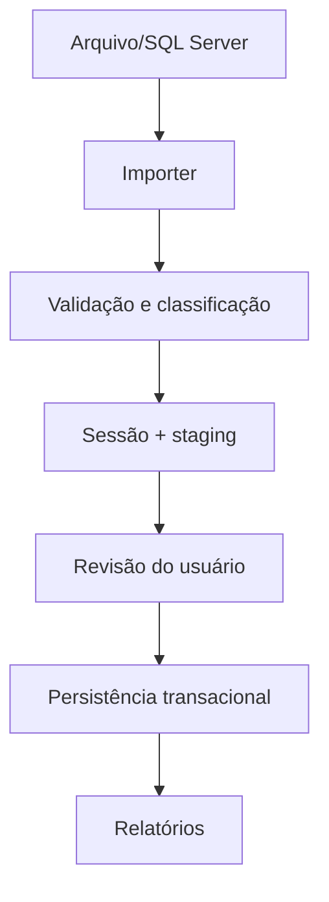
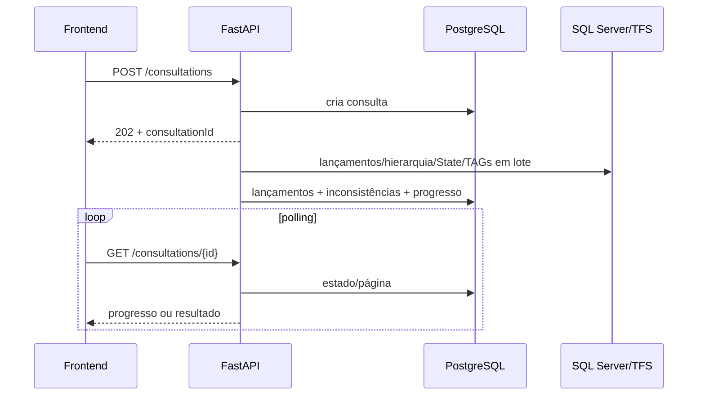
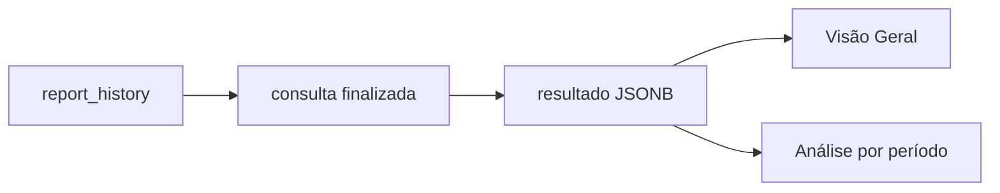

# Arquitetura técnica

Revisão: **10/08/2026**.

## Visão geral


```mermaid
flowchart LR
  U["Usuário"] --> F["React + Vite"]
  F --> A["FastAPI"]
  A --> P["PostgreSQL"]
  A --> S["SQL Server / TFS 2015"]
  A --> X["pandas / openpyxl"]
```

## Camadas do backend

| Camada | Responsabilidade |
| --- | --- |
| `api/routes` | HTTP, validação de parâmetros e tradução de exceções |
| `schemas` | contratos Pydantic |
| `services` | casos de uso, regras, transações e orquestração |
| `repositories` | SQL PostgreSQL |
| `sqlserver_service` | leitura em lote do TFS/SQL Server |
| `importers` | leitura/normalização de arquivos |
| `db.py` | conexão e transação PostgreSQL |

Uma rota não deve conter regra de cálculo. Serviços não devem montar SQL PostgreSQL quando já existe repository do domínio.

## Inicialização da API


```mermaid
flowchart TD
  A["Startup FastAPI"] --> B["run_database_migrations"]
  B --> C["Validar checksums e aplicar pendentes"]
  C --> D["ensure_runtime_schema"]
  D --> E["cleanup_old_import_sessions"]
  E --> F["API pronta"]
```

Middlewares:

- CORS configurável;
- GZip para respostas a partir de 1.000 bytes.

## Frontend

A aplicação é uma SPA React sem React Router. `App.tsx` controla a seção ativa e o `AppShell` controla menu, accordion e cabeçalhos.

Padrão:

```text
Page
→ Hook
→ Service HTTP
→ API
```

Responsabilidades:

- `pages`: composição de tela e fluxo;
- `components`: apresentação reutilizável;
- `hooks`: estado assíncrono;
- `services`: fetch e contratos HTTP;
- `utils`: regras puras de apresentação/validação;
- `types`: contratos TypeScript.

Páginas grandes são carregadas com `lazy` e `Suspense`.

## Arquitetura de Projetos


```mermaid
flowchart TD
  A["Arquivo/SQL Server"] --> B["Importer"]
  B --> C["Validação e classificação"]
  C --> D["Sessão + staging"]
  D --> E["Revisão do usuário"]
  E --> F["Persistência transacional"]
  F --> G["Relatórios"]
```

O staging separa pré-validação de persistência final.

## Arquitetura de Indicadores Gerais

### Consulta assíncrona


```mermaid
sequenceDiagram
  participant UI as Frontend
  participant API as FastAPI
  participant PG as PostgreSQL
  participant TFS as SQL Server/TFS
  UI->>API: POST /consultations
  API->>PG: cria consulta
  API-->>UI: 202 + consultationId
  API->>TFS: lançamentos/hierarquia/State/TAGs em lote
  API->>PG: lançamentos + inconsistências + progresso
  loop polling
    UI->>API: GET /consultations/{id}
    API->>PG: estado/página
    API-->>UI: progresso ou resultado
  end
```

Consultas oficiais não usam `NOLOCK`. Leitura suja poderia gerar hierarquia e horas inconsistentes no snapshot.

A leitura de hierarquia também recupera `tbl_WorkItemCoreLatest.State` para Task, PBI/Bug, Feature e Epic. A informação é obtida em lote junto com os Work Items resolvidos, evitando consultas individuais por lançamento.

### Finalização

O serviço:

1. adquire o direito de finalizar;
2. valida estado, ausência de pendências e conteúdo;
3. lê lançamentos já persistidos;
4. lê a configuração atual de pesos;
5. calcula o snapshot com `build_finalized_general_indicators`;
6. gera hashes;
7. persiste `resultado`;
8. cria identidade/histórico do relatório;
9. conclui de forma atômica.

Não há consulta ao TFS nessa etapa.

Lançamentos marcados como removidos por `State = Removed` já chegam à finalização como desconsiderados. Eles permanecem no audit trail, mas não entram nos totais, KPIs, categorias, evolução mensal, distribuição ponderada ou análise por período.

### Relatórios


```mermaid
flowchart LR
  A["report_history"] --> B["consulta finalizada"]
  B --> C["resultado JSONB"]
  C --> D["Visão Geral"]
  C --> E["Análise por período"]
```

A listagem lê campos indexados. O detalhe lê o snapshot persistido e remove a coleção técnica de auditoria quando ela não é necessária para a tela. A análise por período lê o snapshot completo internamente, filtra lançamentos e devolve apenas agregados.

## Concorrência

- estados de processamento impedem duas operações;
- advisory locks protegem criação/atualização de relatórios;
- timestamps permitem recuperar trabalhadores expirados;
- persistência final verifica se o trabalhador ainda é o proprietário da operação;
- consulta finalizada não é sobrescrita.

## Integridade

- transações PostgreSQL com commit/rollback;
- FKs e `ON DELETE` definidos por domínio;
- checks de período, duração, status, hash e contagens;
- índices parciais para estados ativos;
- hashes SHA-256 do snapshot/resultado;
- versões de cálculo no snapshot.

## Decisões importantes

- PostgreSQL é a fonte do histórico oficial.
- SQL Server/TFS é somente leitura.
- snapshot é imutável.
- atualização de configuração não altera histórico.
- análise por período reutiliza o motor oficial e pesos históricos.
- Work Items com `State = Removed` são tratados como desconsideração automática auditável, não como pendência do usuário.
- `IdLancamento` não pode ser agregado ou substituído por outro lançamento.
- nomes `annual_*` permanecem temporariamente por compatibilidade.

## Segurança

Implementado:

- credenciais por ambiente;
- conta SQL Server somente leitura recomendada;
- CORS configurável;
- validação Pydantic;
- SQL parametrizado;
- logs de auditoria para configurações;
- exclusão transacional.

Pendente:

- identidade corporativa;
- autorização por perfil;
- secrets manager;
- rate limiting;
- trilha de usuário confiável no servidor.
