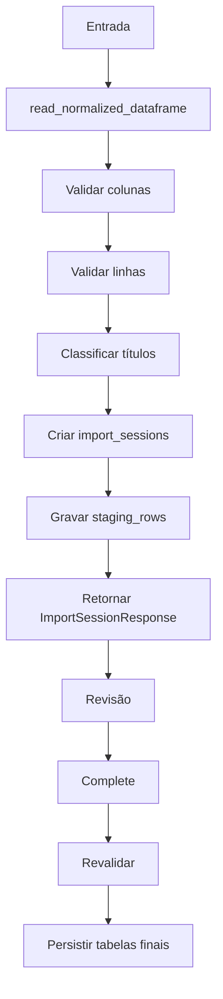

# Importação e staging

Revisão: **28/07/2026**.

## Objetivo

Evitar gravação definitiva de dados antes de o usuário revisar estrutura, duplicidades e classificações.

## Origens

### Arquivo

- Excel ou CSV;
- normalização de cabeçalhos;
- em Excel com várias abas, primeira aba com todas as colunas obrigatórias.

### SQL Server

- teste de conexão;
- busca por IDs de Epic/Feature;
- prévia convertida para o mesmo DataFrame do fluxo de arquivo;
- nenhum bypass das validações.

## Pipeline



## Colunas obrigatórias

```text
IdLancamento
DataHoraCadastro
Task
LoginUsuario
Duracao
IdTask
TituloTask
IdPBI
TituloPBI
IdFeat
TituloFeat
IdEpic
TituloEpic
```

## Sessão temporária

`import_sessions` guarda:

- nome e hash;
- conteúdo original;
- estado;
- contagens;
- vínculo com importação final.

`staging_rows` guarda:

- linha;
- IDs e título;
- dados originais JSONB;
- categoria/subcategoria sugeridas;
- origem e confiança.

## Reprocessamento

`POST /api/imports/sessions/{session_id}/reprocess`:

- relê o conteúdo;
- reaplica validação;
- usa configurações atuais;
- substitui a visão temporária;
- não altera importações já confirmadas.

Para importações existentes:

- `GET /api/imports/{id}/reprocess-preview`;
- `POST /api/imports/{id}/reprocess-apply`;
- `GET /api/imports/{id}/reprocess-history`.

## Confirmação

`POST /api/imports/sessions/{session_id}/complete`:

1. verifica sessão;
2. valida escolhas de duplicidade e overrides;
3. revalida bloqueios;
4. cria `importacoes`;
5. cria `lancamentos_horas`;
6. grava erros, duplicidades e classificações;
7. registra logs/auditoria;
8. vincula a sessão à importação final.

A operação é transacional.

## Cancelamento e limpeza

- `DELETE /api/imports/sessions/{id}` cancela sessão;
- startup remove sessões antigas não confirmadas;
- retenção padrão: 7 dias;
- configurar por `IMPORT_SESSION_RETENTION_DAYS`.

## Compatibilidade

Endpoints antigos permanecem:

- `POST /api/imports/validate`;
- `POST /api/imports/complete`.

Novos clientes devem preferir o fluxo por sessão.

## Observações

- o domínio de importação é independente dos Indicadores Gerais;
- um relatório de projeto nasce de uma importação confirmada;
- a consulta SQL Server de Projetos não é a mesma consulta especializada dos Indicadores Gerais;
- alterações em regras devem ser testadas nos dois fluxos quando houver código compartilhado.
