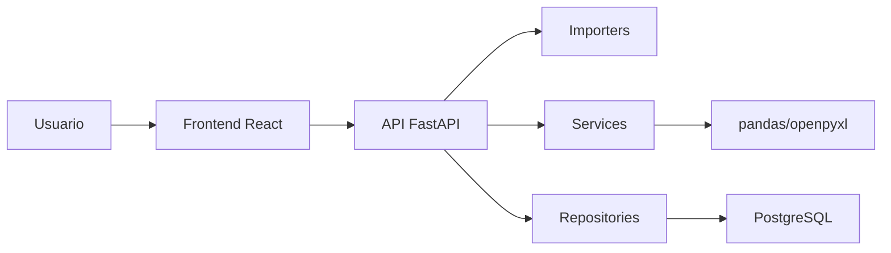
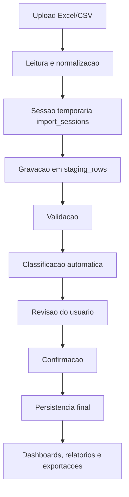
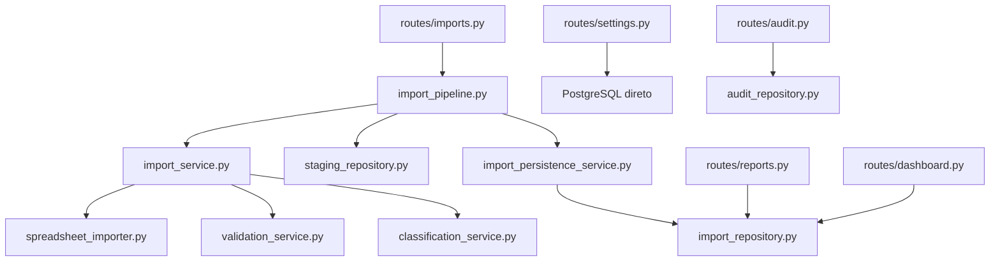
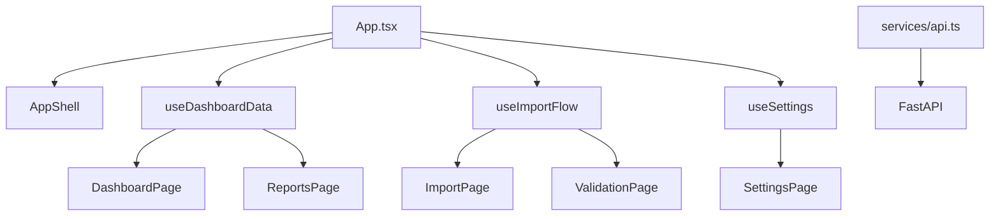

# Documentacao Tecnica Completa - Gerenciador de Projetos

## 1. Objetivo do sistema

O Gerenciador de Projetos e um sistema interno para analise operacional e gerencial de horas apontadas em projetos a partir de planilhas Excel/CSV exportadas do TFS 2015.

O sistema permite importar uma base de apontamentos, validar a estrutura dos dados, classificar automaticamente atividades por categoria/subcategoria, revisar pendencias, consolidar os registros e gerar dashboards, relatorios e exportacoes.

O foco do produto e analise operacional de projetos, incluindo:

- Total de horas por projeto/importacao.
- Horas por colaborador.
- Horas por categoria e subcategoria.
- Horas por Epic, Feature, PBI e Task.
- Evolucao temporal do projeto.
- Classificacao automatica e revisao humana.
- Comparacao entre projetos/importacoes.
- Exportacoes executivas e operacionais.

O sistema nao tem objetivo de ser:

- Controle de ponto.
- Banco de horas.
- Sistema trabalhista.
- Sistema de RH.
- Ferramenta formal de jornada.

## 2. Arquitetura utilizada

O sistema utiliza arquitetura web em camadas, com frontend separado do backend e banco relacional.



### Camadas principais

- **Frontend**: interface React/TypeScript com telas ativas de Dashboard, Importacao, Validacao, Relatorios e Configuracoes.
- **Backend API**: FastAPI expondo endpoints REST.
- **Importers**: leitura e normalizacao de arquivos Excel/CSV.
- **Services**: regras de negocio, validacao, classificacao, staging, persistencia e schema runtime.
- **Repositories**: acesso direto ao PostgreSQL.
- **Banco de dados**: PostgreSQL com tabelas finais, staging, configuracoes, logs, auditoria e historicos internos.
- **Infra local**: Docker Compose com servicos `db` e `backend`; frontend roda via Vite.

Observacao: Historico, Auditoria e Inteligencia Operacional permanecem no codigo/backend, mas estao ocultos na navegacao principal do frontend.

### Fluxo arquitetural da importacao



## 3. Estrutura de pastas

```text
analise-horas-tfs/
  backend/
    Dockerfile
    requirements.txt
app/
      api/
        routes/
          analytics.py
          audit.py
          dashboard.py
          exports.py
          imports.py
          reports.py
          settings.py
      core/
        config.py
      importers/
        spreadsheet_importer.py
      repositories/
        analytics_repository.py
        audit_repository.py
        import_repository.py
        staging_repository.py
      schemas/
        imports.py
      services/
        analytics_service.py
        classification_service.py
        import_pipeline.py
        import_persistence_service.py
        import_record_builder.py
        import_service.py
        schema_service.py
        staging_row_builder.py
        validation_service.py
      db.py
      main.py
    tests/
      test_classification_service.py
      test_import_pipeline.py
      test_import_persistence_service.py
      test_import_record_builder.py
      test_import_service.py
      test_staging_row_builder.py
      test_validation_service.py
  database/
    init.sql
  docs/
    01-especificacao-funcional.md
    02-tabela-regras.md
    03-modelo-dados.md
    04-fluxo-telas.md
    05-mvp.md
    06-backlog-tecnico.md
    07-arquitetura-tecnica.md
    08-fase-2-importacao-staging.md
    09-documentacao-tecnica-completa.md
  frontend/
    package.json
    vite.config.ts
    src/
      components/
        reports/
        settings/
        validation/
      hooks/
      pages/
      services/
      types/
      utils/
      App.tsx
      main.tsx
      styles.css
  samples/
  docker-compose.yml
  README.md
```

## 4. Banco de dados

O banco principal e PostgreSQL. A criacao inicial esta em `database/init.sql`, e ajustes incrementais sao garantidos em runtime por `backend/app/services/schema_service.py`.

### Tabelas de configuracao

| Tabela | Finalidade |
| --- | --- |
| `categorias` | Cadastro das categorias de classificacao. |
| `subcategorias` | Cadastro das subcategorias tecnicas ou operacionais. |
| `palavras_chave_categoria` | Palavras-chave vinculadas a categorias. |
| `classification_rules` | Regras configuraveis de classificacao, com categoria, subcategoria, prioridade e versao. |
| `perfis_colaborador` | Perfil tecnico do colaborador, usado para sugerir subcategoria. |
| `colaboradores_ignorados` | Colaboradores sem perfil que o usuario decidiu ignorar na configuracao. |

### Tabelas de importacao

| Tabela | Finalidade |
| --- | --- |
| `import_sessions` | Sessao temporaria de importacao antes da confirmacao final. |
| `staging_rows` | Linhas cruas/processadas da planilha em staging. |
| `import_logs` | Logs estruturados de processamento da importacao. |
| `importacoes` | Registro final de uma importacao confirmada. |
| `lancamentos_horas` | Registros consolidados de horas importadas. |
| `erros_importacao` | Bloqueios e alertas encontrados na importacao. |
| `duplicidades_importacao` | Duplicidades por `IdLancamento` e resolucoes aplicadas. |
| `classificacoes_task` | Classificacao sugerida/final de cada lancamento. |

### Tabelas de relatorios, pendencias e auditoria

| Tabela | Finalidade |
| --- | --- |
| `pending_reviews` | Status de revisao/ignoracao de pendencias operacionais. |
| `analytics_insights` | Historico persistido dos insights operacionais gerados por importacao. |
| `comparativos_projetos` | Comparativos salvos entre importacoes/projetos. |
| `comparativos_projetos_importacoes` | Relacao N:N entre comparativo e importacoes. |
| `audit_log` | Auditoria runtime para eventos de importacao e reprocessamento. |
| `auditoria_acoes` | Tabela historica de auditoria definida no `init.sql`. |
| `classification_reprocess_history` | Historico de reclassificacao apos reprocessamento. |

### Relacionamentos principais

- `lancamentos_horas.importacao_id` referencia `importacoes.id`.
- `lancamentos_horas.categoria_id` referencia `categorias.id`.
- `lancamentos_horas.subcategoria_id` referencia `subcategorias.id`.
- `classificacoes_task.lancamento_id` referencia `lancamentos_horas.id`.
- `erros_importacao.importacao_id` referencia `importacoes.id`.
- `duplicidades_importacao.importacao_id` referencia `importacoes.id`.
- `import_sessions.importacao_final_id` referencia `importacoes.id`.
- `staging_rows.session_id` referencia `import_sessions.id`.
- `import_logs.session_id` referencia `import_sessions.id`.
- `import_logs.importacao_id` referencia `importacoes.id`.
- `pending_reviews.importacao_id` referencia `importacoes.id`.
- `analytics_insights.importacao_id` referencia `importacoes.id`.
- `classification_rules.categoria_id` referencia `categorias.id`.
- `classification_rules.subcategoria_id` referencia `subcategorias.id`.
- `perfis_colaborador.subcategoria_id` referencia `subcategorias.id`.
- `comparativos_projetos_importacoes.comparativo_id` referencia `comparativos_projetos.id`.
- `comparativos_projetos_importacoes.importacao_id` referencia `importacoes.id`.

### Observacoes sobre schema

- O projeto ainda nao usa ferramenta formal de migrations.
- O `schema_service.py` executa `CREATE TABLE IF NOT EXISTS`, `ALTER TABLE ADD COLUMN IF NOT EXISTS` e criacao de indices no startup.
- Para uma versao corporativa, recomenda-se migrar para Alembic ou processo equivalente.

## 5. Regras de negocio

### Regras de importacao

- Arquivos aceitos: Excel/CSV exportados do TFS 2015.
- O projeto/importacao usa o nome do arquivo como identificador visual; o nome do projeto e derivado do nome do arquivo sem extensao.
- A planilha precisa conter as colunas obrigatorias:
  - `IdLancamento`
  - `DataHoraCadastro`
  - `Task`
  - `LoginUsuario`
  - `Duracao`
  - `IdTask`
  - `TituloTask`
  - `IdPBI`
  - `TituloPBI`
  - `IdFeat`
  - `TituloFeat`
  - `IdEpic`
  - `TituloEpic`
- A hierarquia TFS considerada e `Epic > Feature > PBI > Task`.
- Os dados inicialmente entram em staging e so vao para as tabelas finais apos confirmacao do usuario.
- O sistema calcula historico de arquivo/projeto por `hash_arquivo`, nome do arquivo e `IdLancamento`.

### Regras de validacao

- Colunas obrigatorias ausentes geram bloqueio.
- Campos obrigatorios vazios geram bloqueio.
- `Duracao` deve estar no formato `HH:MM:SS`.
- `Duracao = 00:00:00` gera alerta, mas nao bloqueia.
- `DataHoraCadastro` precisa ser uma data/hora valida.
- Duracao acima de 12 horas gera alerta operacional.
- Titulos muito genericos geram alerta operacional.
- Colaborador sem perfil tecnico aplicado gera alerta operacional.

### Regras de duplicidade

- Duplicidade e detectada somente por `IdLancamento`.
- Se houver mais de uma linha com o mesmo `IdLancamento`, a importacao fica bloqueada.
- O usuario pode escolher uma linha para manter.
- Linhas duplicadas removidas nao entram na persistencia final.

### Regras de classificacao

- O primeiro colchete do titulo, no formato `[Categoria]`, e a fonte oficial da categoria.
- A categoria entre colchetes deve existir e estar ativa nas configuracoes.
- Quando o padrao nao existe ou a categoria nao esta cadastrada/ativa, o registro fica como `Nao classificado` para revisao.
- Subcategorias representam cargos/perfis operacionais do colaborador, como Analista, Desenvolvedor Back-end, Desenvolvedor Front-end, QA, Banco de Dados, Infraestrutura ou DataOps, e sao usadas nas analises por esforco.
- O score de confianca usa valores entre 0 e 1 no backend.
- O nivel de confianca e:
  - `alta` para confianca alta;
  - `media` para confianca intermediaria;
  - `baixa` para confianca baixa ou conflito.
- A revisao deve considerar atividades com confianca abaixo de 90%.
- Registros com mesmo `IdTask` podem ser tratados em grupo na revisao.
- Overrides manuais de categoria/subcategoria sao aplicados no momento da conclusao.

### Regras de relatorios

- Horas sao calculadas com base em `duracao_segundos`.
- A duracao original e preservada em `duracao_original`.
- Nao ha regra trabalhista, hora extra ou banco de horas.
- Os relatorios sao analiticos e operacionais.
- Pendencias podem ser marcadas como `pendente`, `revisado` ou `ignorado`.

## 6. Fluxos principais

### Fluxo de importacao com staging

1. Usuario seleciona arquivo Excel/CSV.
2. Frontend envia arquivo para `POST /api/imports/sessions`.
3. Backend calcula hash do arquivo.
4. Backend normaliza colunas e dados.
5. Backend valida colunas, linhas, duracao, datas e duplicidades.
6. Backend classifica atividades.
7. Backend grava sessao em `import_sessions`.
8. Backend grava linhas temporarias em `staging_rows`.
9. Frontend exibe pre-validacao, saude da importacao e classificacoes.
10. Usuario revisa duplicidades/classificacoes quando necessario.
11. Usuario confirma.
12. Frontend chama `POST /api/imports/sessions/{session_id}/complete`.
13. Backend valida novamente bloqueios.
14. Backend monta registros finais a partir de `staging_rows`.
15. Backend persiste `importacoes`, `lancamentos_horas`, `erros_importacao`, `duplicidades_importacao` e `classificacoes_task`.
16. Backend registra logs e auditoria.
17. Frontend redireciona para Relatorios.

### Fluxo de reprocessamento de sessao

1. Usuario aciona reprocessamento antes da confirmacao.
2. Backend reler o arquivo salvo em `import_sessions.conteudo_arquivo`.
3. Backend aplica regras atuais de validacao/classificacao.
4. Backend limpa e recria `staging_rows`.
5. Sessao permanece aguardando confirmacao.

### Fluxo de cancelamento

1. Usuario cancela uma sessao em staging.
2. Backend marca a sessao como `CANCELADO`.
3. Logs e auditoria sao registrados.
4. Como `staging_rows` referencia `import_sessions` com cascade, os dados temporarios podem ser descartados quando a sessao e removida.

### Fluxo de relatorios

1. Usuario acessa Relatorios.
2. Sistema lista projetos/importacoes confirmadas.
3. Usuario abre um projeto.
4. Frontend carrega cabecalho, KPIs, aba Executivo, aba Graficos e aba Tasks.
5. Aba Executivo mostra resumo inteligente em texto, destaques do projeto, rankings e alertas executivos.
6. Aba Graficos mostra tendencias visuais e analises especificas por colaborador/categoria.
7. Aba Tasks mostra tasks por colaborador com paginacao de 20 em 20.
8. Usuario pode exportar PDF Executivo e Excel Operacional pelo menu de exportacao.

### Fluxo de configuracoes

1. Usuario acessa Configuracoes.
2. Pode manter categorias, subcategorias, palavras-chave, regras e perfis de colaboradores.
3. Alteracoes impactam proximas classificacoes e reprocessamentos.
4. Categorias/subcategorias inativas nao devem ser usadas como opcoes ativas.

### Fluxo de auditoria

1. Eventos importantes sao registrados em `audit_log`.
2. Endpoint `GET /api/audit` permanece disponivel.
3. A tela de Auditoria esta oculta na navegacao atual.

## 7. Tecnologias utilizadas

### Frontend

- React 18.
- TypeScript.
- Vite.
- Recharts.
- Lucide React.
- CSS global em `styles.css`.

### Backend

- Python.
- FastAPI.
- Uvicorn.
- Pydantic.
- Pydantic Settings.
- pandas.
- openpyxl.
- SQLAlchemy.
- psycopg.

### Banco e infraestrutura

- PostgreSQL 16 Alpine.
- Docker Compose.
- Dockerfile do backend.
- Volume Docker para persistencia do PostgreSQL.

## 8. APIs e integracoes

O sistema nao possui integracao direta com TFS via API. A integracao atual e por arquivos Excel/CSV exportados do TFS 2015.

### Base da API

```text
http://localhost:8000/api
```

### Health

| Metodo | Endpoint | Finalidade |
| --- | --- | --- |
| GET | `/api/health` | Verifica se a API esta ativa. |

### Imports

| Metodo | Endpoint | Finalidade |
| --- | --- | --- |
| POST | `/api/imports/validate` | Valida arquivo diretamente, mantido por compatibilidade. |
| POST | `/api/imports/complete` | Conclui importacao direta por arquivo, mantido por compatibilidade. |
| POST | `/api/imports/sessions` | Cria sessao de importacao em staging. |
| POST | `/api/imports/sessions/{session_id}/reprocess` | Reprocessa uma sessao em staging. |
| POST | `/api/imports/sessions/{session_id}/complete` | Confirma sessao e persiste dados finais. |
| DELETE | `/api/imports/sessions/{session_id}` | Cancela sessao temporaria. |
| GET | `/api/imports` | Lista importacoes confirmadas. |
| GET | `/api/imports/{import_id}` | Detalha uma importacao. |
| GET | `/api/imports/{import_id}/reprocess-preview` | Simula reclassificacao de importacao existente. |
| POST | `/api/imports/{import_id}/reprocess-apply` | Aplica reprocessamento de classificacao. |
| GET | `/api/imports/{import_id}/reprocess-history` | Lista historico de reclassificacao. |

### Dashboard

| Metodo | Endpoint | Finalidade |
| --- | --- | --- |
| GET | `/api/dashboard/overview` | KPIs, projetos recentes e dados de apoio ao dashboard. |
| GET | `/api/dashboard/summary` | Indicadores resumidos. |
| GET | `/api/dashboard/timeline` | Linha do tempo agregada. |

### Analytics

| Metodo | Endpoint | Finalidade |
| --- | --- | --- |
| GET | `/api/analytics/insights` | Consulta insights operacionais salvos com filtros por importacao, tipo, severidade e status. |
| POST | `/api/analytics/insights/generate` | Gera insights para uma importacao e salva em `analytics_insights`. |
| PATCH | `/api/analytics/insights/{insight_id}/status` | Atualiza status do insight para `novo`, `revisado` ou `ignorado`. |

### Reports

| Metodo | Endpoint | Finalidade |
| --- | --- | --- |
| GET | `/api/reports/hours` | Relatorio agregado de horas. |
| GET | `/api/reports/overview` | Visao geral de relatorios. |
| GET | `/api/reports/project-timelines` | Graficos de linha do tempo por projeto. |
| GET | `/api/reports/project-comparison` | Comparacao entre importacoes. |
| GET | `/api/reports/project-evolution-options` | Opcoes de projetos com versoes/evolucao. |
| GET | `/api/reports/project-evolution` | Evolucao de um projeto entre importacoes. |
| GET | `/api/reports/project-comparisons` | Lista comparativos salvos. |
| POST | `/api/reports/project-comparisons` | Cria comparativo salvo. |
| GET | `/api/reports/project-comparisons/{comparison_id}` | Detalha comparativo salvo. |
| DELETE | `/api/reports/project-comparisons/{comparison_id}` | Remove comparativo salvo. |
| GET | `/api/reports/project-summary` | Resumo executivo de projeto. |
| GET | `/api/reports/project-pending-items` | Pendencias do projeto. |
| PATCH | `/api/reports/project-pending-alerts/{alert_id}` | Atualiza alerta de importacao. |
| PATCH | `/api/reports/project-pending-reviews` | Atualiza status de pendencia operacional. |
| GET | `/api/reports/project-insights` | Insights operacionais do projeto. |
| GET | `/api/reports/project-recommendations` | Recomendacoes operacionais do projeto. |
| GET | `/api/reports/project-collaborator-tasks` | Tasks por colaborador. |
| GET | `/api/reports/filters` | Opcoes de filtros para dashboard/relatorios. |

### Exports

| Metodo | Endpoint | Finalidade |
| --- | --- | --- |
| GET | `/api/exports/consolidated.csv` | Exporta consolidado CSV. |
| GET | `/api/exports/report.csv` | Exporta relatorio CSV. |
| GET | `/api/exports/project-analysis.xlsx` | Exporta analise de projeto em Excel. |
| GET | `/api/exports/project-comparison.xlsx` | Exporta comparativo de projetos em Excel. |
| GET | `/api/exports/project-evolution.xlsx` | Exporta evolucao de projeto em Excel. |

### Settings

| Metodo | Endpoint | Finalidade |
| --- | --- | --- |
| GET | `/api/settings/categories` | Lista categorias. |
| POST | `/api/settings/categories` | Cria categoria. |
| PATCH | `/api/settings/categories/{category_id}` | Atualiza categoria. |
| GET | `/api/settings/subcategories` | Lista subcategorias. |
| POST | `/api/settings/subcategories` | Cria subcategoria. |
| PATCH | `/api/settings/subcategories/{subcategory_id}` | Atualiza subcategoria. |
| GET | `/api/settings/keywords` | Lista palavras-chave. |
| POST | `/api/settings/keywords` | Cria palavra-chave. |
| PATCH | `/api/settings/keywords/{keyword_id}` | Atualiza palavra-chave. |
| GET | `/api/settings/collaborator-profiles` | Lista perfis de colaborador. |
| POST | `/api/settings/collaborator-profiles` | Cria perfil de colaborador. |
| PATCH | `/api/settings/collaborator-profiles/{profile_id}` | Atualiza perfil de colaborador. |
| GET | `/api/settings/ignored-collaborators` | Lista colaboradores ignorados. |
| POST | `/api/settings/ignored-collaborators` | Ignora colaborador sem perfil. |
| DELETE | `/api/settings/ignored-collaborators/{ignored_id}` | Restaura colaborador ignorado. |
| GET | `/api/settings/classification-rules` | Lista regras de classificacao. |
| POST | `/api/settings/classification-rules` | Cria regra de classificacao. |
| PATCH | `/api/settings/classification-rules/{rule_id}` | Atualiza regra de classificacao. |

### Audit

| Metodo | Endpoint | Finalidade |
| --- | --- | --- |
| GET | `/api/audit` | Consulta logs de auditoria. |

## 9. Controle de permissoes

Atualmente o sistema nao possui autenticacao, login ou autorizacao por perfil.

Estado atual:

- Telas ativas no frontend: Dashboard, Importacao, Validacao, Relatorios e Configuracoes.
- Telas ocultas no frontend: Historico, Auditoria e Inteligencia Operacional.
- A API nao exige token.
- Eventos de auditoria usam usuario padrao `sistema`.
- A tela de configuracoes permite manter regras/categorias sem controle de perfil.

Premissas futuras:

- Criar autenticacao corporativa ou local.
- Separar perfis como administrador, operador e gestor.
- Restringir configuracoes e auditoria a usuarios autorizados.
- Registrar usuario real em auditoria, reprocessamentos e alteracoes de classificacao.

## 10. Funcionalidades existentes

### Importacao

- Upload de Excel/CSV.
- Validacao de colunas obrigatorias.
- Staging temporario.
- Reprocessamento de sessao.
- Cancelamento de sessao.
- Confirmacao final.
- Identificacao de arquivo ja importado por hash.
- Identificacao de nova versao de projeto pelo nome do arquivo e diferenca de `IdLancamento`.
- Validacao de duplicidades por `IdLancamento`.
- Escolha de linha mantida em duplicidades.

### Classificacao

- Classificacao automatica por regras, palavras-chave, titulo e contexto TFS.
- Score de confianca.
- Nivel de confianca.
- Versao do classificador.
- Uso de perfil tecnico do colaborador para subcategoria.
- Edicao/revisao por atividade agrupada por Task.
- Aplicacao de overrides manuais.
- Reprocessamento de classificacao em importacoes existentes.

### Dashboard

- Visao inicial dos projetos analisados.
- Ultimos projetos analisados.
- Acesso rapido para relatorios.
- Informacoes operacionais de alerta foram reduzidas na interface para priorizar analise de horas.

### Inteligencia Operacional

- Modulo preservado no backend, mas oculto no frontend.
- Analise de tendencias entre importacoes do mesmo projeto.
- Identificacao de concentracao de horas por colaborador.
- Identificacao de classificacoes abaixo de 90% de confianca.
- Identificacao de pendencias operacionais abertas.
- Identificacao de lancamentos superiores a 12 horas.
- Identificacao de titulos genericos.
- Persistencia em `analytics_insights`.
- Historico por importacao.
- Status `novo`, `revisado` e `ignorado`.
- Auditoria ao revisar ou ignorar insight.
- Filtros por projeto, importacao, tipo, severidade e status.

### Relatorios

- Listagem executiva de projetos/importacoes.
- Aba Executivo com KPIs, resumo inteligente em texto, destaques do projeto, rankings e alertas executivos.
- Aba Graficos focada em tendencias visuais:
  - evolucao diaria do projeto;
  - distribuicao das horas por categoria;
  - produtividade diaria/semanal por colaborador;
  - evolucao diaria/semanal/mensal por categoria.
- Aba Tasks com detalhe por colaborador e paginacao de 20 em 20.
- Comparativos entre projetos.
- Evolucao de um projeto entre importacoes.
- Exportacoes PDF Executivo e Excel Operacional.

### Configuracoes

- Categorias.
- Cargos, armazenados em `subcategorias`.
- Colaboradores, armazenados em `perfis_colaborador`.
- Busca por aba.
- Modais para criacao/edicao.
- Validacao de duplicidade por normalizacao de acentos, caixa e espacos.
- Grupos automaticos por cargo.

### Historico

- Modulo preservado no codigo, mas oculto no frontend.
- Lista importacoes.
- Detalhe de importacao.
- Lancamentos importados.
- Paginacao de lancamentos.

### Auditoria

- Modulo preservado no backend/codigo, mas oculto no frontend.
- Registro de eventos de importacao, sessao e reprocessamento.
- Endpoint de consulta de auditoria.
- Filtros por entidade, acao e busca.

## 11. Funcionalidades planejadas

Funcionalidades ja discutidas ou recomendadas para evolucao:

- Analise de Sprint separada da analise de horas.
- Importacao de planilhas TFS de Work Items/Sprints.
- Dashboard de Sprint Analytics.
- Comparacao Sprint atual x Sprint anterior.
- Login e permissoes.
- Registro de usuario real em auditoria.
- Migrations formais.
- Logs de importacao mais detalhados em tela.
- Motor de insights local mais estruturado.
- Preparacao para IA local/opcional em analises complexas.
- Dark mode.
- Melhorias de performance em importacoes grandes.
- Cache de consultas pesadas no backend.
- Paginacao/virtualizacao em listas grandes no frontend.
- Testes automatizados de API e frontend.
- Deploy interno corporativo.

## 12. Dependencias entre modulos

### Backend



### Frontend



### Dependencias funcionais

- Dashboard depende de importacoes confirmadas.
- Relatorios dependem de `lancamentos_horas`, categorias, subcategorias, erros e pendencias.
- Configuracoes impactam novas classificacoes e reprocessamentos.
- Validacao depende das colunas obrigatorias e regras de duplicidade.
- Classificacao depende de categorias, subcategorias, regras, palavras-chave e perfis de colaboradores.
- Auditoria depende de eventos inseridos pelos services/repositories.

## 13. Padroes de codigo utilizados

### Backend

- FastAPI com routers por dominio.
- Services para regras de negocio.
- Repositories para acesso ao banco.
- Schemas Pydantic para contratos de importacao.
- Uso de funcoes pequenas para validacao, classificacao e persistencia.
- SQL explicito com psycopg/SQLAlchemy connection.
- Startup hook para garantir schema runtime.
- Testes unitarios em `backend/tests`.
- Nomes de funcoes descritivos.

### Frontend

- React com TypeScript.
- Componentes por pagina e por dominio.
- Hooks para encapsular estado e chamadas de API.
- `services/api.ts` como cliente central da API.
- Lazy loading de paginas.
- Estado principal de navegacao em `App.tsx`.
- Persistencia da ultima secao no `localStorage`.
- Tipos centralizados em `types.ts` e `types/`.
- CSS global com classes por modulo/tela.
- Uso de icones Lucide.
- Graficos com Recharts.

### Banco

- Nomes de tabelas em portugues.
- Chaves primarias serial.
- Relacionamentos por foreign key.
- Indices para consultas recorrentes.
- `ON DELETE CASCADE` em entidades filhas de importacao.
- `ON DELETE SET NULL` onde o historico deve ser preservado.

## 14. Pontos de melhoria identificados

### Arquitetura e manutencao

- Adotar migrations formais com Alembic para substituir alteracoes runtime em `schema_service.py`.
- Separar queries grandes de `reports.py`, `dashboard.py` e `settings.py` em repositories/services dedicados.
- Criar schemas Pydantic tambem para settings, reports e dashboard.
- Padronizar nomenclatura de auditoria: hoje existem `audit_log` e `auditoria_acoes`.
- Avaliar consolidacao de `auditoria_acoes` se nao houver uso real.
- Criar camada unica de tratamento de erros HTTP.

### Banco e performance

- Avaliar indices adicionais para consultas por `id_task`, `titulo_task`, `login_usuario`, `categoria_id` e datas.
- Criar tabelas/materializacoes de resumo se relatorios ficarem lentos.
- Medir tempo de processamento por etapa usando `import_logs`.
- Evitar revalidacoes desnecessarias na conclusao quando a sessao ja possui staging consistente.
- Implementar paginacao em detalhes de importacao e pendencias grandes.

### Frontend e UX

- Quebrar `styles.css` por dominio ou adotar CSS modules/estrutura equivalente.
- Reduzir tamanho de componentes grandes, especialmente telas de relatorios/configuracoes.
- Adicionar skeleton loading padronizado.
- Adicionar toasts padronizados.
- Padronizar drawers/modais para detalhes e filtros avancados.
- Melhorar responsividade em telas menores.
- Adicionar testes de componentes e fluxos principais.

### Seguranca e permissoes

- Implementar autenticacao.
- Implementar perfis de acesso.
- Proteger endpoints de configuracao, auditoria e reprocessamento.
- Registrar usuario real em alteracoes.
- Rever CORS para ambiente corporativo.

### Produto e funcionalidades

- Separar formalmente o futuro modulo Sprint Analytics da analise de horas.
- Definir modelo de dados especifico para Sprints antes de codificar.
- Criar metricas de uso real de categorias, subcategorias, palavras-chave e regras na tela de configuracoes.
- Melhorar explicabilidade do score de confianca.
- Criar painel de logs de importacao por sessao/importacao.
- Criar rotina de limpeza de sessoes temporarias antigas.

### Qualidade

- Criar suite de testes de API com FastAPI TestClient.
- Criar testes de frontend.
- Criar script unico para validacao local:
  - compile backend;
  - testes backend;
  - build frontend.
- Documentar cenarios de importacao com planilhas exemplo.
