# Diagramas, Endpoints e Fluxos dos Modulos

## Estrutura do banco em SQL

A estrutura consolidada do banco foi separada em:

```text
docs/10-estrutura-banco.sql
```

Esse arquivo consolida:

- `database/init.sql`;
- tabelas criadas em runtime por `backend/app/services/schema_service.py`;
- colunas adicionadas em runtime;
- indices principais.

## Diagrama das tabelas

```mermaid
erDiagram
  CATEGORIAS ||--o{ PALAVRAS_CHAVE_CATEGORIA : possui
  CATEGORIAS ||--o{ CLASSIFICATION_RULES : define
  CATEGORIAS ||--o{ LANCAMENTOS_HORAS : classifica
  CATEGORIAS ||--o{ CLASSIFICACOES_TASK : sugerida_final

  SUBCATEGORIAS ||--o{ PERFIS_COLABORADOR : define
  SUBCATEGORIAS ||--o{ CLASSIFICATION_RULES : define
  SUBCATEGORIAS ||--o{ LANCAMENTOS_HORAS : classifica
  SUBCATEGORIAS ||--o{ CLASSIFICACOES_TASK : sugerida_final

  IMPORTACOES ||--o{ LANCAMENTOS_HORAS : contem
  IMPORTACOES ||--o{ ERROS_IMPORTACAO : registra
  IMPORTACOES ||--o{ DUPLICIDADES_IMPORTACAO : registra
  IMPORTACOES ||--o{ IMPORT_LOGS : registra
  IMPORTACOES ||--o{ PENDING_REVIEWS : possui
  IMPORTACOES ||--o{ ANALYTICS_INSIGHTS : gera
  IMPORTACOES ||--o{ CLASSIFICATION_REPROCESS_HISTORY : historico
  IMPORTACOES ||--o{ COMPARATIVOS_PROJETOS_IMPORTACOES : participa
  IMPORTACOES ||--o{ AUDITORIA_ACOES : audita

  IMPORT_SESSIONS ||--o{ STAGING_ROWS : possui
  IMPORT_SESSIONS ||--o{ IMPORT_LOGS : registra
  IMPORT_SESSIONS }o--|| IMPORTACOES : gera

  LANCAMENTOS_HORAS ||--o{ CLASSIFICACOES_TASK : possui
  LANCAMENTOS_HORAS ||--o{ CLASSIFICATION_REPROCESS_HISTORY : historico
  LANCAMENTOS_HORAS ||--o{ DUPLICIDADES_IMPORTACAO : mantido

  COMPARATIVOS_PROJETOS ||--o{ COMPARATIVOS_PROJETOS_IMPORTACOES : possui

  CATEGORIAS {
    int id PK
    varchar nome
    boolean ativa
    timestamp criado_em
  }

  SUBCATEGORIAS {
    int id PK
    varchar nome
    boolean ativa
    timestamp criado_em
  }

  PALAVRAS_CHAVE_CATEGORIA {
    int id PK
    int categoria_id FK
    varchar palavra
    boolean ativa
    timestamp criado_em
  }

  CLASSIFICATION_RULES {
    int id PK
    varchar nome
    int categoria_id FK
    int subcategoria_id FK
    jsonb palavras_chave
    int prioridade
    boolean ativa
    varchar versao
  }

  PERFIS_COLABORADOR {
    int id PK
    varchar login_usuario
    int subcategoria_id FK
    boolean ativo
  }

  COLABORADORES_IGNORADOS {
    int id PK
    varchar login_usuario
    boolean ativo
  }

  IMPORTACOES {
    int id PK
    varchar nome_arquivo
    varchar hash_arquivo
    varchar status
    timestamp data_importacao
    int total_registros
    int registros_validos
    int registros_com_alerta
    int registros_bloqueados
    varchar versao_classificador
  }

  IMPORT_SESSIONS {
    int id PK
    varchar nome_arquivo
    varchar hash_arquivo
    bytea conteudo_arquivo
    varchar status
    int importacao_final_id FK
  }

  STAGING_ROWS {
    int id PK
    int session_id FK
    int linha
    varchar id_lancamento
    varchar id_task
    varchar login_usuario
    text titulo_task
    jsonb dados_originais
    numeric confianca
  }

  LANCAMENTOS_HORAS {
    int id PK
    int importacao_id FK
    varchar id_lancamento
    timestamp data_hora_cadastro
    varchar login_usuario
    varchar duracao_original
    int duracao_segundos
    varchar id_epic
    varchar id_feat
    varchar id_pbi
    varchar id_task
    int categoria_id FK
    int subcategoria_id FK
  }

  CLASSIFICACOES_TASK {
    int id PK
    int lancamento_id FK
    text titulo_task
    int categoria_sugerida_id FK
    int subcategoria_sugerida_id FK
    int categoria_final_id FK
    int subcategoria_final_id FK
    varchar origem_classificacao
    numeric confianca
    varchar nivel_confianca
    varchar versao_classificador
  }

  ERROS_IMPORTACAO {
    int id PK
    int importacao_id FK
    int linha
    varchar campo
    varchar tipo_erro
    varchar severidade
    boolean resolvido
  }

  DUPLICIDADES_IMPORTACAO {
    int id PK
    int importacao_id FK
    varchar id_lancamento
    jsonb linhas_envolvidas
    int registro_mantido_id FK
    boolean resolvido
  }

  IMPORT_LOGS {
    int id PK
    int session_id FK
    int importacao_id FK
    varchar etapa
    varchar nivel
    varchar evento
    jsonb metricas
  }

  PENDING_REVIEWS {
    int id PK
    int importacao_id FK
    varchar tipo
    varchar chave
    varchar status
  }

  ANALYTICS_INSIGHTS {
    int id PK
    int importacao_id FK
    varchar tipo
    varchar severidade
    varchar titulo
    text descricao
    text recomendacao
    jsonb metricas_json
    varchar status
    timestamp gerado_em
    timestamp revisado_em
    varchar usuario_revisao
  }

  COMPARATIVOS_PROJETOS {
    int id PK
    varchar nome
  }

  COMPARATIVOS_PROJETOS_IMPORTACOES {
    int id PK
    int comparativo_id FK
    int importacao_id FK
    int ordem
  }

  AUDIT_LOG {
    int id PK
    varchar entidade
    varchar registro_id
    varchar acao
    varchar usuario
    jsonb antes
    jsonb depois
  }

  AUDITORIA_ACOES {
    int id PK
    int importacao_id FK
    varchar entidade
    varchar entidade_id
    varchar acao
    jsonb valor_anterior
    jsonb valor_novo
  }

  CLASSIFICATION_REPROCESS_HISTORY {
    int id PK
    int importacao_id FK
    int lancamento_id FK
    varchar categoria_anterior
    varchar categoria_nova
    numeric confianca_anterior
    numeric confianca_nova
    varchar usuario
  }
```

## Lista de endpoints da API

Base local:

```text
http://localhost:8000/api
```

### Health

| Metodo | Endpoint | Modulo | Descricao |
| --- | --- | --- | --- |
| GET | `/api/health` | Sistema | Verifica se a API esta ativa. |

### Importacao

| Metodo | Endpoint | Descricao |
| --- | --- | --- |
| POST | `/api/imports/validate` | Valida arquivo sem staging. Mantido por compatibilidade. |
| POST | `/api/imports/complete` | Conclui importacao sem staging. Mantido por compatibilidade. |
| POST | `/api/imports/sessions` | Cria sessao temporaria, valida, classifica e grava staging. |
| POST | `/api/imports/sessions/{session_id}/reprocess` | Reprocessa uma sessao temporaria com regras atuais. |
| POST | `/api/imports/sessions/{session_id}/complete` | Confirma sessao e grava tabelas finais. |
| DELETE | `/api/imports/sessions/{session_id}` | Cancela sessao temporaria. |
| GET | `/api/imports` | Lista importacoes confirmadas. |
| GET | `/api/imports/{import_id}` | Retorna detalhe da importacao. |
| GET | `/api/imports/{import_id}/reprocess-preview` | Gera previa de reclassificacao de importacao existente. |
| POST | `/api/imports/{import_id}/reprocess-apply` | Aplica reclassificacao em importacao existente. |
| GET | `/api/imports/{import_id}/reprocess-history` | Lista historico de reclassificacao. |

### Dashboard

| Metodo | Endpoint | Descricao |
| --- | --- | --- |
| GET | `/api/dashboard/overview` | Retorna central operacional, KPIs, projetos recentes e insights. |
| GET | `/api/dashboard/summary` | Retorna indicadores resumidos. |
| GET | `/api/dashboard/timeline` | Retorna linha do tempo agregada. |

### Inteligencia Operacional

| Metodo | Endpoint | Descricao |
| --- | --- | --- |
| GET | `/api/analytics/insights` | Consulta insights operacionais salvos. |
| POST | `/api/analytics/insights/generate` | Gera insights para uma importacao e salva em `analytics_insights`. |
| PATCH | `/api/analytics/insights/{insight_id}/status` | Atualiza status do insight para `novo`, `revisado` ou `ignorado`. |

Filtros aceitos:

| Parametro | Descricao |
| --- | --- |
| `importacao_id` | Importacao especifica dos insights salvos. |
| `type` | Tipo do insight: `anomalia`, `tendencia`, `concentracao`, `qualidade`, `risco`. |
| `severity` | Severidade: `baixa`, `media`, `alta`. |
| `status` | Status: `novo`, `revisado`, `ignorado`. |

### Relatorios

| Metodo | Endpoint | Descricao |
| --- | --- | --- |
| GET | `/api/reports/hours` | Relatorio agregado de horas. |
| GET | `/api/reports/overview` | Visao geral dos relatorios. |
| GET | `/api/reports/project-timelines` | Graficos temporais de um projeto/importacao. |
| GET | `/api/reports/project-comparison` | Comparacao entre importacoes selecionadas. |
| GET | `/api/reports/project-evolution-options` | Lista projetos com mais de uma versao/importacao. |
| GET | `/api/reports/project-evolution` | Evolucao de um projeto entre importacoes. |
| GET | `/api/reports/project-comparisons` | Lista comparativos salvos. |
| POST | `/api/reports/project-comparisons` | Cria comparativo salvo. |
| GET | `/api/reports/project-comparisons/{comparison_id}` | Detalha comparativo salvo. |
| DELETE | `/api/reports/project-comparisons/{comparison_id}` | Exclui comparativo salvo. |
| GET | `/api/reports/project-summary` | Retorna resumo executivo de projeto. |
| GET | `/api/reports/project-pending-items` | Retorna pendencias do projeto. |
| PATCH | `/api/reports/project-pending-alerts/{alert_id}` | Atualiza alerta de importacao. |
| PATCH | `/api/reports/project-pending-reviews` | Atualiza status de pendencia operacional. |
| GET | `/api/reports/project-insights` | Retorna insights operacionais do projeto. |
| GET | `/api/reports/project-recommendations` | Retorna recomendacoes operacionais. |
| GET | `/api/reports/project-collaborator-tasks` | Retorna tasks trabalhadas por colaborador. |
| GET | `/api/reports/filters` | Retorna opcoes de filtros. |

### Exportacoes

| Metodo | Endpoint | Descricao |
| --- | --- | --- |
| GET | `/api/exports/consolidated.csv` | Exporta consolidado geral em CSV. |
| GET | `/api/exports/report.csv` | Exporta relatorio em CSV. |
| GET | `/api/exports/project-analysis.xlsx` | Exporta analise de projeto em Excel. |
| GET | `/api/exports/project-comparison.xlsx` | Exporta comparativo de projetos em Excel. |
| GET | `/api/exports/project-evolution.xlsx` | Exporta evolucao do projeto em Excel. |

### Configuracoes

| Metodo | Endpoint | Descricao |
| --- | --- | --- |
| GET | `/api/settings/categories` | Lista categorias. |
| POST | `/api/settings/categories` | Cria categoria. |
| PATCH | `/api/settings/categories/{category_id}` | Atualiza categoria. |
| GET | `/api/settings/subcategories` | Lista subcategorias. |
| POST | `/api/settings/subcategories` | Cria subcategoria. |
| PATCH | `/api/settings/subcategories/{subcategory_id}` | Atualiza subcategoria. |
| GET | `/api/settings/keywords` | Lista palavras-chave. |
| POST | `/api/settings/keywords` | Cria palavra-chave. |
| PATCH | `/api/settings/keywords/{keyword_id}` | Atualiza palavra-chave. |
| GET | `/api/settings/collaborator-profiles` | Lista perfis de colaboradores. |
| POST | `/api/settings/collaborator-profiles` | Cria perfil de colaborador. |
| PATCH | `/api/settings/collaborator-profiles/{profile_id}` | Atualiza perfil de colaborador. |
| GET | `/api/settings/ignored-collaborators` | Lista colaboradores ignorados. |
| POST | `/api/settings/ignored-collaborators` | Ignora colaborador sem perfil. |
| DELETE | `/api/settings/ignored-collaborators/{ignored_id}` | Restaura colaborador ignorado. |
| GET | `/api/settings/classification-rules` | Lista regras de classificacao. |
| POST | `/api/settings/classification-rules` | Cria regra de classificacao. |
| PATCH | `/api/settings/classification-rules/{rule_id}` | Atualiza regra de classificacao. |

### Auditoria

| Metodo | Endpoint | Descricao |
| --- | --- | --- |
| GET | `/api/audit` | Consulta logs de auditoria com filtros. |

## Fluxo de cada modulo

### 1. Dashboard

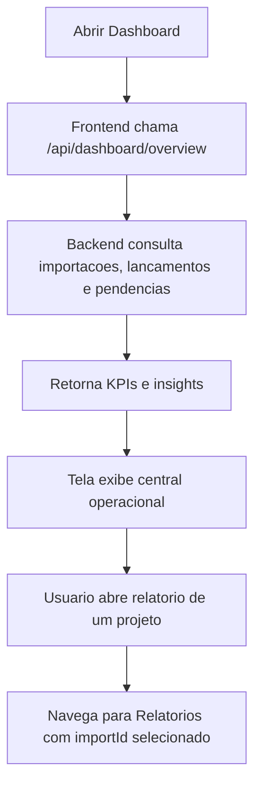

### 2. Importacao

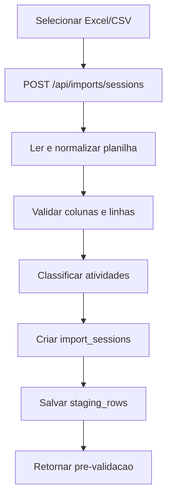

### 2.1 Inteligencia Operacional

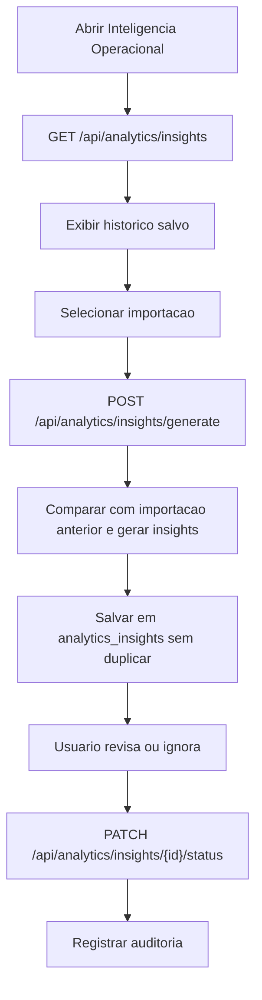

### 3. Validacao e classificacao

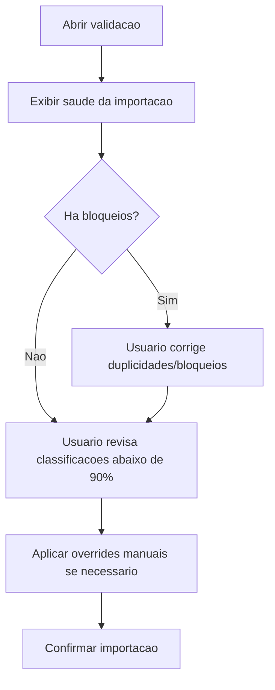

### 4. Confirmacao da importacao

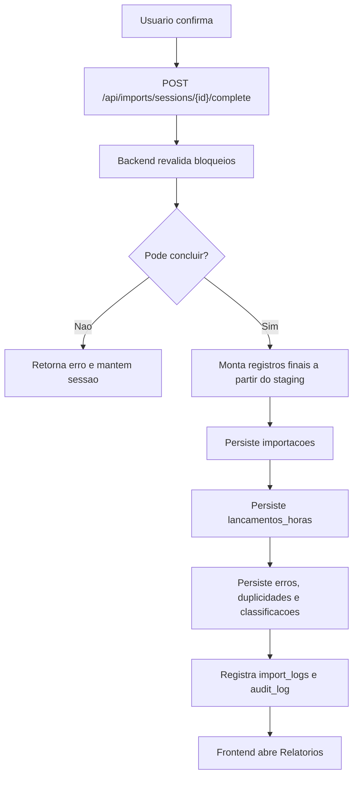

### 5. Relatorios

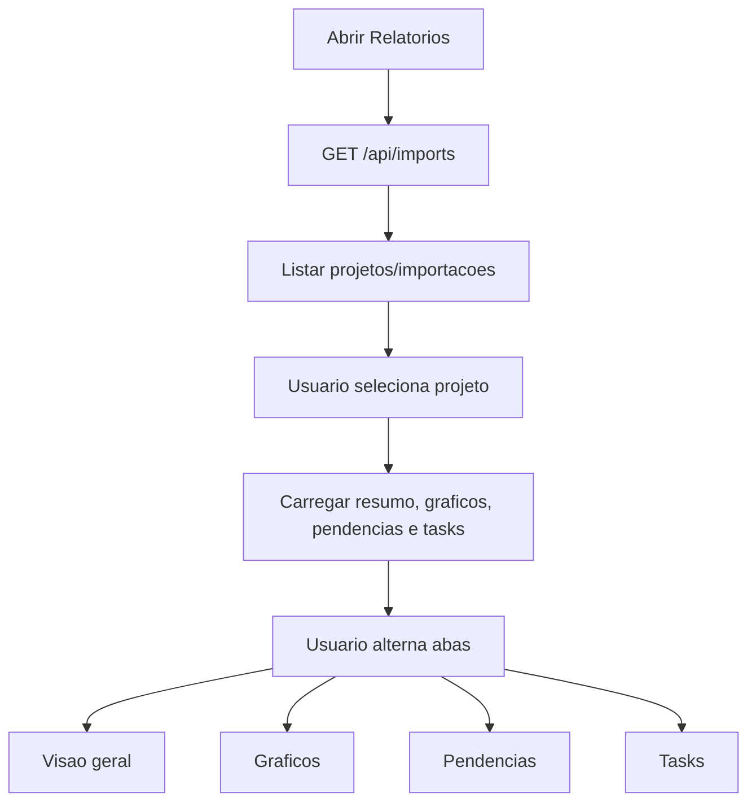

### 6. Pendencias do relatorio

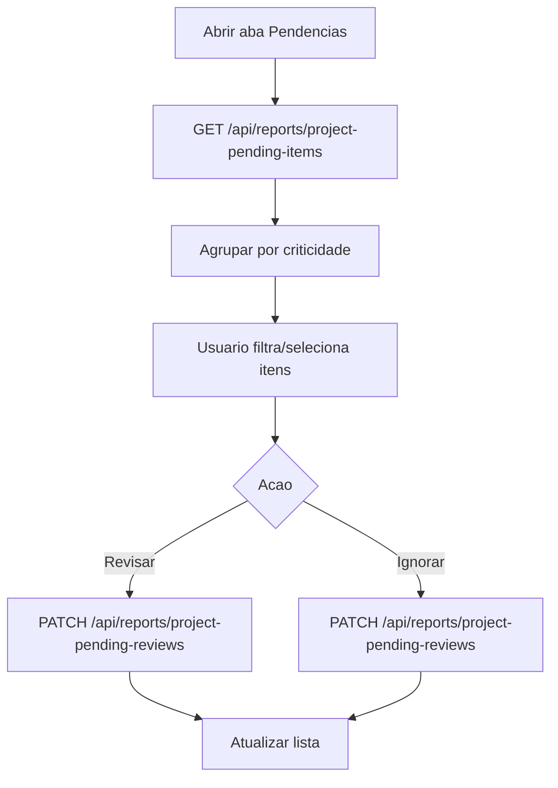

### 7. Tasks por colaborador

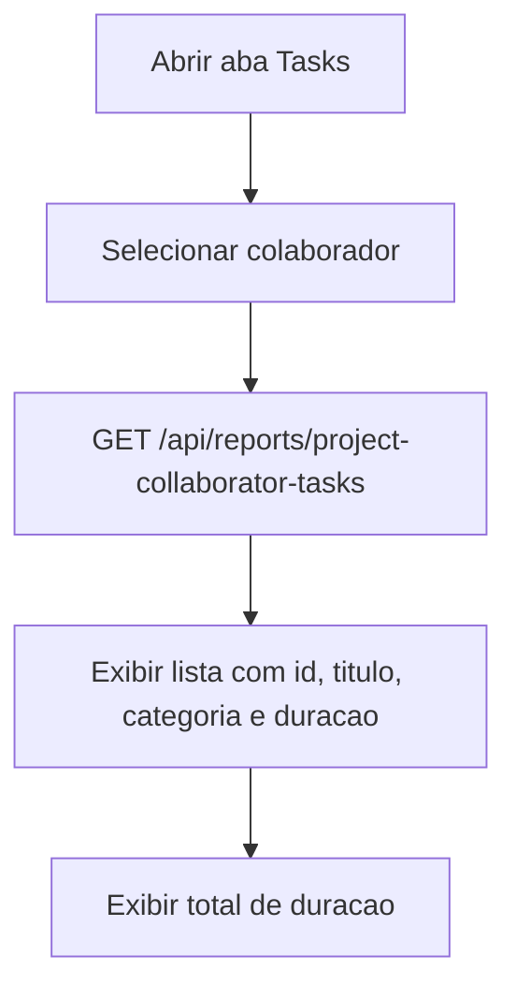

### 8. Comparativos

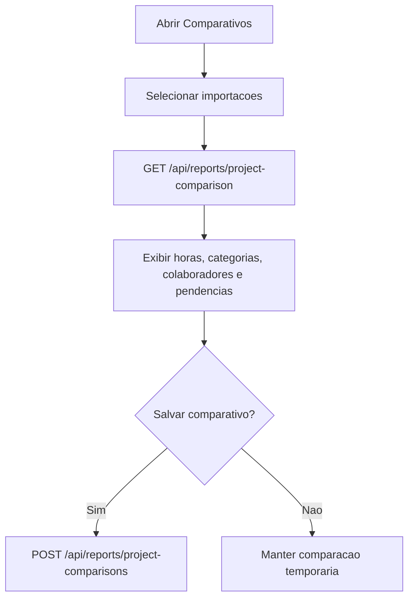

### 9. Evolucao do projeto

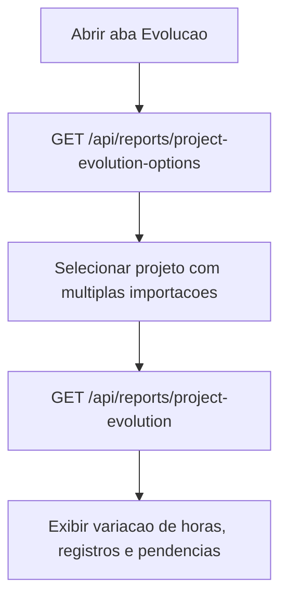

### 10. Historico

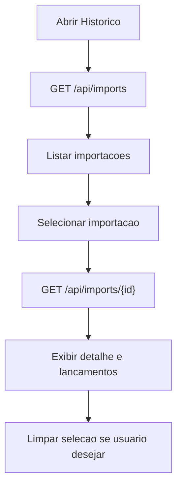

### 11. Configuracoes

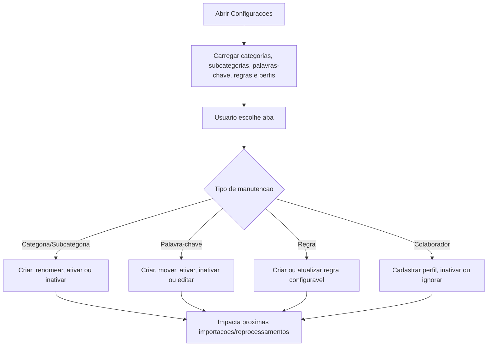

### 12. Auditoria

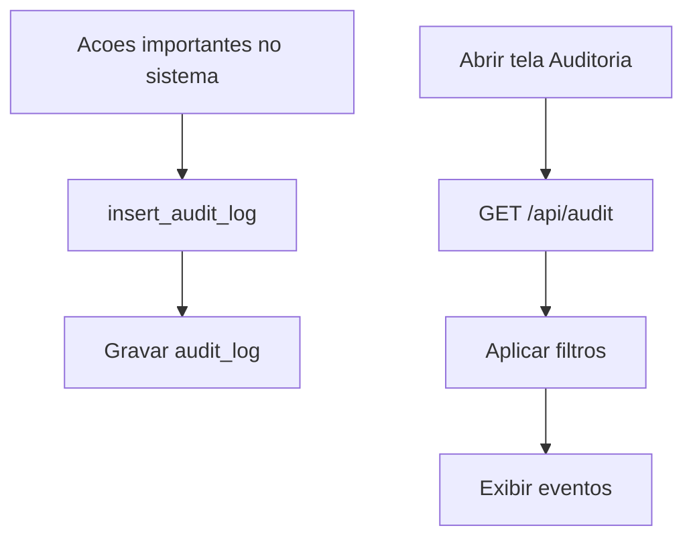

### 13. Exportacoes

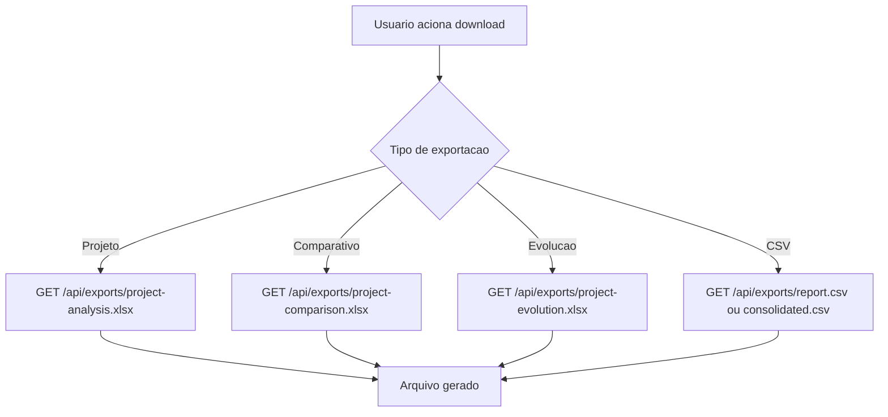
