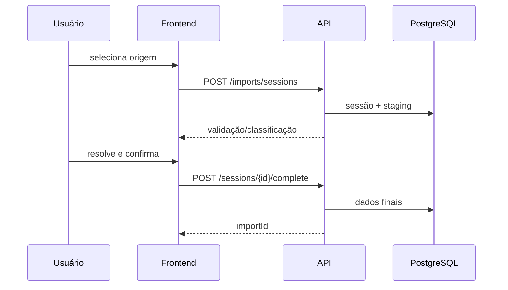
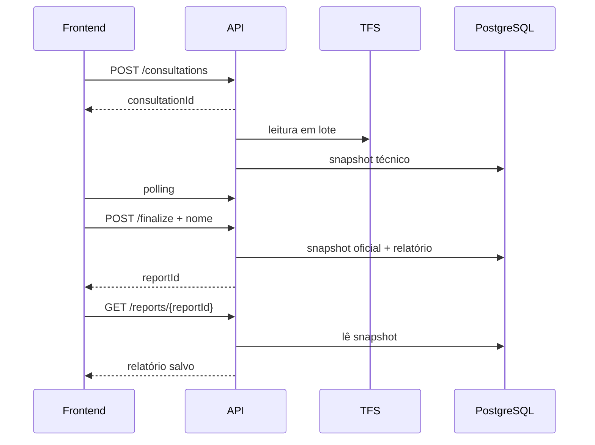
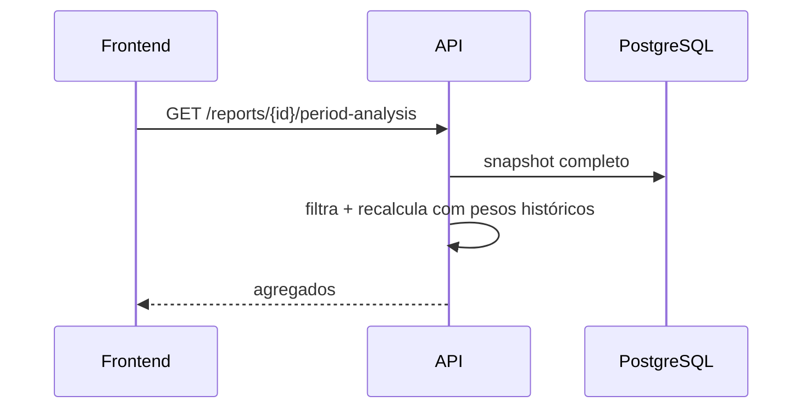

# Endpoints e fluxos

Revisão: **28/07/2026**.

Base local:

```text
http://127.0.0.1:8000/api
```

Contratos executáveis:

- Swagger: `/docs`;
- OpenAPI: `/openapi.json`;
- schemas Pydantic: `backend/app/schemas`;
- tipos frontend: `frontend/src/types.ts` e `frontend/src/types`.

`*` indica parâmetro obrigatório.

## Sistema

| Método | Endpoint | Descrição |
| --- | --- | --- |
| GET | `/api/health` | Saúde da API; retorna `{"status":"ok"}` |

## Importações

| Método | Endpoint | Descrição |
| --- | --- | --- |
| POST | `/api/imports/validate` | Validação direta legada |
| POST | `/api/imports/complete` | Conclusão direta legada |
| POST | `/api/imports/sessions` | Cria sessão por upload |
| POST | `/api/imports/sessions/{session_id}/reprocess` | Reprocessa staging |
| POST | `/api/imports/sessions/{session_id}/complete` | Confirma sessão |
| DELETE | `/api/imports/sessions/{session_id}` | Cancela sessão |
| GET/POST | `/api/imports/sqlserver/test-connection` | Testa conexão |
| POST | `/api/imports/sqlserver/preview` | Cria sessão a partir do SQL Server |
| GET | `/api/imports` | Lista importações |
| GET | `/api/imports/{import_id}` | Detalha importação |
| GET | `/api/imports/{import_id}/reprocess-preview` | Prévia de reclassificação |
| POST | `/api/imports/{import_id}/reprocess-apply` | Aplica reclassificação |
| GET | `/api/imports/{import_id}/reprocess-history` | Histórico |

Uploads usam `multipart/form-data`. Overrides, linhas mantidas e opções de reprocessamento são definidos nos schemas de importação.

## Dashboard

| Método | Endpoint | Descrição |
| --- | --- | --- |
| GET | `/api/dashboard/overview` | KPIs, projetos e central operacional |
| GET | `/api/dashboard/summary` | Resumo agregado |
| GET | `/api/dashboard/timeline` | Linha do tempo |

O módulo permanece no backend, mas não está no menu atual.

## Relatórios de Projetos

| Método | Endpoint | Descrição |
| --- | --- | --- |
| GET | `/api/reports/hours` | Horas agregadas |
| GET | `/api/reports/overview` | Visão geral |
| GET | `/api/reports/project-timelines` | Séries temporais |
| GET | `/api/reports/project-comparison` | Comparação avulsa |
| GET | `/api/reports/project-evolution-options` | Projetos elegíveis |
| GET | `/api/reports/project-evolution` | Evolução entre importações |
| GET | `/api/reports/project-comparisons` | Lista comparativos |
| POST | `/api/reports/project-comparisons` | Salva comparativo |
| GET | `/api/reports/project-comparisons/{comparison_id}` | Detalha comparativo |
| DELETE | `/api/reports/project-comparisons/{comparison_id}` | Exclui comparativo |
| GET | `/api/reports/project-summary` | Resumo executivo |
| GET | `/api/reports/project-pending-items` | Pendências |
| PATCH | `/api/reports/project-pending-alerts/{alert_id}` | Atualiza alerta |
| PATCH | `/api/reports/project-pending-reviews` | Atualiza revisão |
| GET | `/api/reports/project-insights` | Insights |
| GET | `/api/reports/project-recommendations` | Recomendações |
| GET | `/api/reports/project-collaborator-tasks` | Tasks por colaborador |
| GET | `/api/reports/filters` | Opções de filtro |

Filtros variam por endpoint e incluem importação/projeto, período, colaborador, categoria e subcategoria. Swagger é a referência de parâmetros.

## Exportações

| Método | Endpoint | Descrição |
| --- | --- | --- |
| GET | `/api/exports/consolidated.csv` | Consolidado CSV |
| GET | `/api/exports/report.csv` | Relatório CSV |
| GET | `/api/exports/project-analysis.xlsx` | Análise de projeto |
| GET | `/api/exports/project-comparison.xlsx` | Comparativo |
| GET | `/api/exports/project-evolution.xlsx` | Evolução |

## Configurações

### Bootstrap

| Método | Endpoint | Descrição |
| --- | --- | --- |
| GET | `/api/settings/bootstrap` | Retorna configurações em uma única chamada |

### Categorias

| Método | Endpoint |
| --- | --- |
| GET/POST | `/api/settings/categories` |
| PATCH/DELETE | `/api/settings/categories/{category_id}` |

### Subcategorias

| Método | Endpoint |
| --- | --- |
| GET/POST | `/api/settings/subcategories` |
| PATCH/DELETE | `/api/settings/subcategories/{subcategory_id}` |

### Palavras-chave

| Método | Endpoint |
| --- | --- |
| GET/POST | `/api/settings/keywords` |
| PATCH | `/api/settings/keywords/{keyword_id}` |

### Colaboradores

| Método | Endpoint |
| --- | --- |
| GET/POST | `/api/settings/collaborator-profiles` |
| PATCH/DELETE | `/api/settings/collaborator-profiles/{profile_id}` |
| GET/POST | `/api/settings/ignored-collaborators` |
| DELETE | `/api/settings/ignored-collaborators/{ignored_id}` |

### Regras

| Método | Endpoint |
| --- | --- |
| GET/POST | `/api/settings/classification-rules` |
| PATCH | `/api/settings/classification-rules/{rule_id}` |

### Pesos

| Método | Endpoint | Descrição |
| --- | --- | --- |
| GET | `/api/settings/distribution-weights` | Lista configuração |
| PUT | `/api/settings/distribution-weights` | Salva todos os pesos |
| POST | `/api/settings/distribution-weights/restore-defaults` | Restaura padrão |

Cabeçalho opcional de usuário é tratado conforme a rota atual. O serviço valida lista completa, pesos 1–5 e pelo menos uma categoria ativa.

## Indicadores Gerais — consulta

### Iniciar

```http
POST /api/general-indicators/consultations
  ?startDate=2026-01-01
  &endDate=2026-03-31
```

Resposta `202 Accepted`:

```json
{
  "consultationId": 123,
  "status": "CONSULTANDO"
}
```

O processamento continua em background.

### Acompanhar

```http
GET /api/general-indicators/consultations/{consultation_id}
  ?page=1
  &pageSize=100
```

Limites:

- `page >= 1`;
- `1 <= pageSize <= 500`.

Durante processamento, retorna progresso persistido. Ao concluir, retorna resumo, pendências, capacidade de finalizar e página de lançamentos.

### Atualizar pendências

```http
POST /api/general-indicators/consultations/{consultation_id}/pending-refresh
  ?page=1
  &pageSize=100
```

Reconsulta somente entidades afetadas.

### Refazer consulta

```http
POST /api/general-indicators/consultations/{consultation_id}/full-refresh
  ?confirm=true
  &page=1
  &pageSize=100
```

Sem `confirm=true`, retorna `422`.

### Salvar/finalizar

```http
POST /api/general-indicators/consultations/{consultation_id}/finalize
Content-Type: application/json

{
  "reportName": "1º Trimestre 2026"
}
```

Condições:

- consulta existente;
- estado pronto;
- ao menos um lançamento elegível;
- sem operação concorrente;
- nome com 1 a 255 caracteres.

A resposta inclui `reportId`, usado pelo frontend para abrir o relatório.

### Resultado e auditoria

| Método | Endpoint | Uso |
| --- | --- | --- |
| GET | `/api/general-indicators/consultations/{consultation_id}/result` | Snapshot oficial |
| GET | `/api/general-indicators/consultations/{consultation_id}/audit?page=1&pageSize=100` | Auditoria paginada |

### Endpoint síncrono legado

```http
GET /api/general-indicators/consultation
  ?startDate=...
  &endDate=...
  &page=1
  &pageSize=100
```

Mantido por compatibilidade técnica. Novos clientes devem usar `POST /consultations` e polling.

### Erros principais

| HTTP | Situação |
| --- | --- |
| 400 | erro de integração/dados |
| 404 | consulta não encontrada |
| 409 | concorrência ou consulta finalizada |
| 422 | período/estado/confirmação/regra inválida |
| 503 | configuração ou conexão SQL Server |
| 504 | timeout SQL Server |

## Meus Relatórios

### Listagem

```http
GET /api/general-indicators/reports
  ?type=GENERAL_INDICATORS
  &year=2026
  &search=trimestre
  &page=1
  &pageSize=20
```

Parâmetros:

| Parâmetro | Regra |
| --- | --- |
| `type` | padrão `GENERAL_INDICATORS` |
| `year` | 2000–2200 |
| `search` | até 255 caracteres |
| `page` | mínimo 1 |
| `pageSize` | 1–100 |

Resposta:

```json
{
  "items": [],
  "page": 1,
  "pageSize": 20,
  "totalItems": 0,
  "totalPages": 0
}
```

Itens incluem nome, período, revisão, total, lançamentos considerados, colaboradores excluídos, KPIs, responsável e estado de atualização.

### Detalhe

```http
GET /api/general-indicators/reports/{report_id}
```

Retorna:

```text
report
currentRevision
snapshot
update
revisionCount
```

Fonte exclusiva: PostgreSQL.

### Análise por período

```http
GET /api/general-indicators/reports/{report_id}/period-analysis
  ?startDate=2026-02-01
  &endDate=2026-03-31
```

Resposta:

```json
{
  "reportId": 36,
  "source": "SAVED_SNAPSHOT",
  "officialPeriod": {
    "startDate": "2026-01-01",
    "endDate": "2026-06-30"
  },
  "analyzedPeriod": {
    "startDate": "2026-02-01",
    "endDate": "2026-03-31"
  },
  "recordCount": 0,
  "totalHours": 0,
  "kpis": {},
  "categories": [],
  "months": []
}
```

O endpoint:

- valida limites;
- usa audit trail e pesos do snapshot;
- não consulta TFS/SQL Server;
- não grava dados;
- não retorna a auditoria técnica.

Erros:

- `404`: relatório inexistente;
- `422`: período inválido ou snapshot sem dados históricos necessários.

### Exclusão

```http
DELETE /api/general-indicators/reports/{report_id}?actor=usuario
```

- permanente;
- transacional;
- sem consulta ao TFS;
- `404` inexistente;
- `409` em processamento.

## Auditoria e analytics

| Método | Endpoint | Observação |
| --- | --- | --- |
| GET | `/api/audit` | Tela fora do menu |
| GET | `/api/analytics/insights` | Lista insights |
| POST | `/api/analytics/insights/generate` | Gera/persiste |
| PATCH | `/api/analytics/insights/{insight_id}/status` | Atualiza status |

## Fluxos resumidos

### Importação


```mermaid
sequenceDiagram
  participant U as Usuário
  participant F as Frontend
  participant A as API
  participant P as PostgreSQL
  U->>F: seleciona origem
  F->>A: POST /imports/sessions
  A->>P: sessão + staging
  A-->>F: validação/classificação
  U->>F: resolve e confirma
  F->>A: POST /sessions/{id}/complete
  A->>P: dados finais
  A-->>F: importId
```

### Indicadores


```mermaid
sequenceDiagram
  participant F as Frontend
  participant A as API
  participant T as TFS
  participant P as PostgreSQL
  F->>A: POST /consultations
  A-->>F: consultationId
  A->>T: leitura em lote
  A->>P: snapshot técnico
  F->>A: polling
  F->>A: POST /finalize + nome
  A->>P: snapshot oficial + relatório
  A-->>F: reportId
  F->>A: GET /reports/{reportId}
  A->>P: lê snapshot
  A-->>F: relatório salvo
```

### Análise por período


```mermaid
sequenceDiagram
  participant F as Frontend
  participant A as API
  participant P as PostgreSQL
  F->>A: GET /reports/{id}/period-analysis
  A->>P: snapshot completo
  A->>A: filtra + recalcula com pesos históricos
  A-->>F: agregados
```
